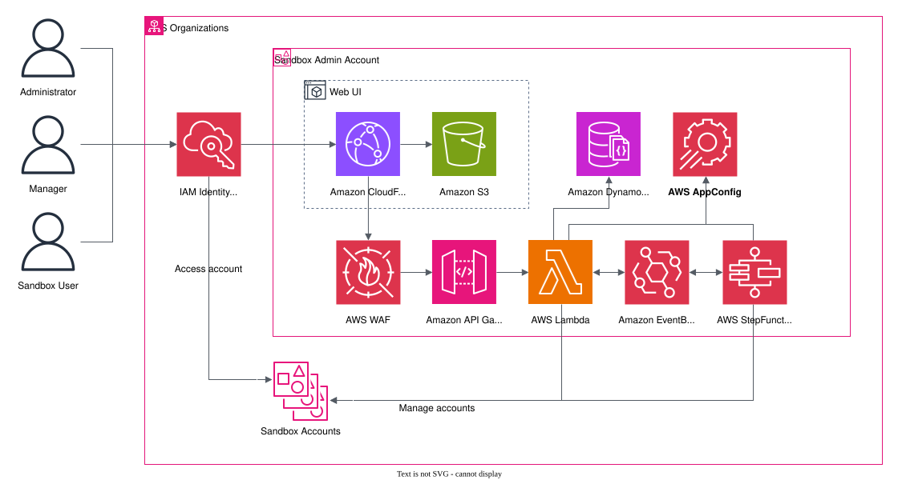

# Sandbox for AWS

Enterprise sandbox account management for AWS Organizations. Automate the lifecycle of temporary sandbox environments with service control policies, spend controls, IAM Identity Center integration, and account recycling.

> Based on [Innovation Sandbox on AWS](https://github.com/aws-solutions/innovation-sandbox-on-aws) v1.1.8 by AWS Solutions, licensed under [Apache 2.0](./LICENSE).

## Table of Contents

- [Architecture](#architecture)
- [Prerequisites](#prerequisites)
- [Environment Variables](#environment-variables)
- [Deploy the Solution](#deploy-the-solution)
- [Running Tests](#running-tests)
- [Using Private ECR Repository](#using-private-ecr-repository)
- [Uninstalling the Solution](#uninstalling-the-solution)
- [Cost Scaling](#cost-scaling)
- [File Structure](#file-structure)
- [Pre-Commit](#pre-commit)
- [License](#license)
- [Contact Information](#contact-information)

## Architecture



Four CDK stacks deploy into your AWS Organization:

| Stack | CloudFormation ID | Purpose |
|-------|------------------|---------|
| Account Pool | `Sandbox-AccountPool` | Sandbox account lifecycle management |
| IDC | `Sandbox-IDC` | IAM Identity Center + SAML integration |
| Data | `Sandbox-Data` | DynamoDB, S3, SES data layer |
| Compute | `Sandbox-Compute` | Lambda, Step Functions, API Gateway |

## Prerequisites

- macOS or Amazon Linux 2
- Node.js 22
- AWS CLI with SSO configured
- Docker (optional, for private ECR)
- Python + pre-commit (optional)

```shell
npm install
```

> **Note:** Many commands require AWS CLI access to target accounts. For multi-account deployments, switch between account credentials as needed.

## Environment Variables

Configure your environment before deploying:

```shell
npm run env:init
```

Edit the generated `.env` file with your account-specific values. See comments in `.env.example` for details.

## Deploy the Solution

### Deployment Prerequisites

The solution requires several prerequisite steps. See the upstream [implementation guide](https://docs.aws.amazon.com/solutions/latest/innovation-sandbox-on-aws/prerequisites.html) for details.

### Deploy from Source

Bootstrap target accounts if not already done:

```shell
npm run bootstrap
```

Single-account deployment:

```shell
npm run deploy:all
```

Multi-account deployment (deploy each stack individually):

```shell
npm run deploy:account-pool
npm run deploy:idc
npm run deploy:data
npm run deploy:compute
```

### Post Deployment Tasks

Complete post-deployment configuration per the upstream [implementation guide](https://docs.aws.amazon.com/solutions/latest/innovation-sandbox-on-aws/post-deployment-configuration-tasks.html).

## Running Tests

### Unit Tests

Run all tests:

```shell
npm test
```

Update snapshot tests:

```shell
npm run test:update-snapshots
```

## Using Private ECR Repository

For development, host a custom AWS Nuke image in your own ECR:

> **Note:** Requires Docker engine installed and running.

1. Create a private ECR repository in the compute stack account/region.
2. Configure `.env` with `PRIVATE_ECR_REPO` and `PRIVATE_ECR_REPO_REGION`.
3. Build and push:
   ```shell
   npm run docker:build-and-push
   ```
4. Redeploy compute stack if already deployed:
   ```shell
   npm run deploy:compute
   ```

## Uninstalling the Solution

Single-account:

```shell
npm run destroy:all
```

Multi-account (per stack):

```shell
npm run destroy:account-pool
npm run destroy:idc
npm run destroy:data
npm run destroy:compute
```

## Cost Scaling

Cost varies by sandbox account usage. Infrastructure-only estimates:

| Deployment Size | Monthly Cost |
|----------------|-------------|
| Small (10 accounts) | ~$36 |
| Medium (300 accounts) | ~$65 |
| Large (1000 accounts) | ~$149 |

See the upstream [cost documentation](https://docs.aws.amazon.com/solutions/latest/innovation-sandbox-on-aws/cost.html) for details.

## File Structure

```
root
├── deployment/                     # Build scripts for CloudFormation distributables
│   ├── global-s3-assets/           # CDK synthesized CloudFormation templates
│   ├── regional-s3-assets/         # Zipped runtime assets (Lambda functions)
│   └── build-s3-dist.sh            # Build distributable assets
├── docs/                           # Architecture diagrams and documentation
├── source/                         # Monorepo workspace packages
│   ├── common/                     # sandbox-commons (shared types + utilities)
│   ├── frontend/                   # sandbox-frontend (Vite + React + Cloudscape UI)
│   ├── infrastructure/             # sandbox-infrastructure (CDK stacks + constructs)
│   ├── lambdas/                    # sandbox-* (Lambda handlers, 21 packages)
│   └── layers/                     # Lambda layers (common + dependencies)
├── .pre-commit-config.yaml         # Pre-commit hook configurations
├── CLAUDE.md                       # AI agent configuration (ADLC v3.0.0)
├── LICENSE                         # Apache 2.0 (original, unmodified)
├── NOTICE                          # Third-party attributions (original, unmodified)
└── package.json                    # Root monorepo (sandbox-for-aws)
```

## Pre-Commit

This repository uses [pre-commit](https://pre-commit.com/) for automated checks:

```shell
pip install pre-commit
pre-commit install
```

Run hooks without committing:

```shell
pre-commit run --all-files
```

## License

Copyright 2026 nnthanh101 ([oceansoft.io](https://oceansoft.io)). All Rights Reserved.

Based on [Innovation Sandbox on AWS](https://github.com/aws-solutions/innovation-sandbox-on-aws) by Amazon.com, Inc.

Licensed under the Apache License Version 2.0 (the "License"). You may not use this file except in compliance with the License. A copy of the License is located at <http://www.apache.org/licenses/> or in the "[LICENSE](./LICENSE)" file accompanying this file. This file is distributed on an "AS IS" BASIS, WITHOUT WARRANTIES OR CONDITIONS OF ANY KIND, express or implied. See the License for the specific language governing permissions and limitations under the License.

## Contact Information

- **Maintainer**: [info@oceansoft.io](mailto:info@oceansoft.io)
- **GitHub Issues**: [github.com/nnthanh101/aws-sandbox/issues](https://github.com/nnthanh101/aws-sandbox/issues)
- **Documentation**: Coming soon (Docusaurus, auto-deployed via GitHub Actions)

## Upstream References

- [Innovation Sandbox on AWS](https://github.com/aws-solutions/innovation-sandbox-on-aws) (upstream source)
- [AWS CDK Documentation](https://docs.aws.amazon.com/cdk/v2/guide/home.html)
- [AWS Account Management](https://docs.aws.amazon.com/accounts/latest/reference/accounts-welcome.html)
- [AWS Nuke](https://github.com/ekristen/aws-nuke)
