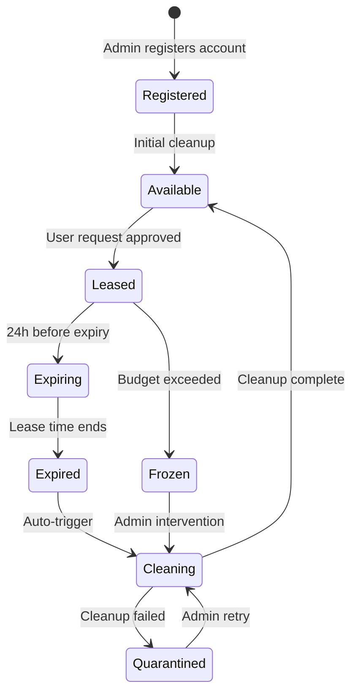
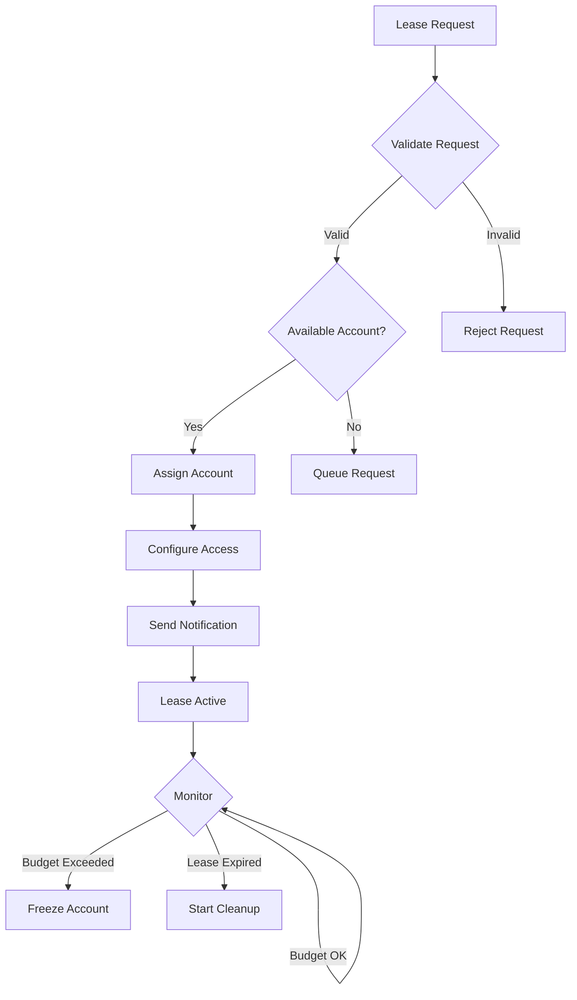
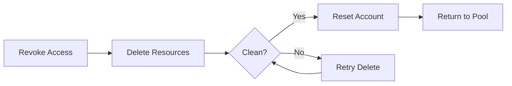

# Account Lifecycle

The sandbox account lifecycle is managed by Step Functions state machines.

## Lifecycle States

## Lease Workflow

## Account Cleanup Process

When a lease expires, the cleanup state machine:

1. **Revoke Access** — Remove SSO permission set assignments
2. **Delete Resources** — Remove all user-created resources
3. **Verify Clean** — Confirm no resources remain
4. **Reset Account** — Restore to baseline configuration
5. **Return to Pool** — Mark as available

## Timing

| Event | Default Duration |
|-------|-----------------|
| Maximum lease | 30 days |
| Extension limit | 15 days |
| Expiry warning | 24 hours before |
| Cleanup timeout | 2 hours |
| Budget check interval | 1 hour |
