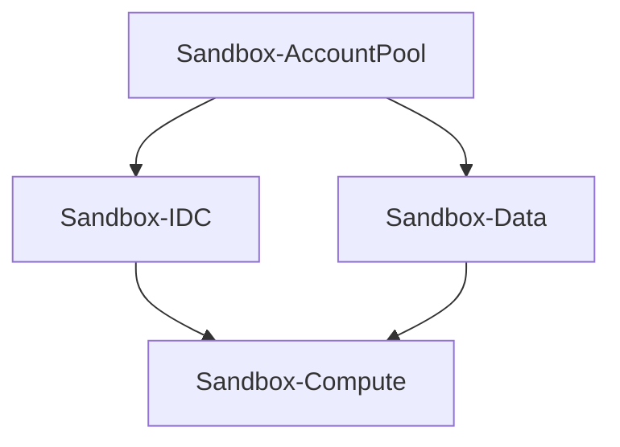
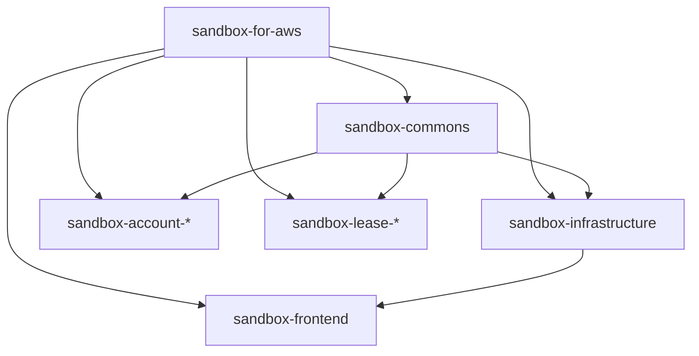

# CDK Stacks Deep Dive

Sandbox for AWS deploys 4 CloudFormation stacks via CDK v2.

## Stack Dependency Graph

## Sandbox-AccountPool

The foundation stack managing the sandbox account pool.

**Resources**: ~15 CloudFormation resources

| Resource Type | Purpose |
|--------------|---------|
| DynamoDB Table | Account pool state tracking |
| Lambda Functions | Account registration, status updates |
| Step Function | Account cleanup orchestration |
| IAM Roles | Cross-account Organizations access |
| Custom Resource | Initial pool configuration |

## Sandbox-IDC

Identity and access management integration.

**Resources**: ~10 CloudFormation resources

| Resource Type | Purpose |
|--------------|---------|
| Custom Resource | Identity Center SAML configuration |
| Lambda Functions | SAML metadata, permission set management |
| IAM Roles | Identity Center API access |
| SSM Parameters | Configuration storage |

## Sandbox-Data

Persistence and notification layer.

**Resources**: ~20 CloudFormation resources

| Resource Type | Purpose |
|--------------|---------|
| DynamoDB Tables | Leases, config, audit logs |
| S3 Buckets | Templates, artifacts, log archives |
| KMS Keys | Encryption at rest |
| SES | Email notifications |
| CloudWatch | Log groups, metrics |

## Sandbox-Compute

API and orchestration layer.

**Resources**: ~40 CloudFormation resources

| Resource Type | Purpose |
|--------------|---------|
| API Gateway | REST API endpoints |
| Lambda Functions | API handlers (10+) |
| Step Functions | Lease lifecycle, account cleanup |
| WAF | API protection |
| CloudFront | Web application CDN |
| S3 Bucket | Frontend static assets |
| CloudWatch | Alarms, dashboards |

## Workspace Packages

