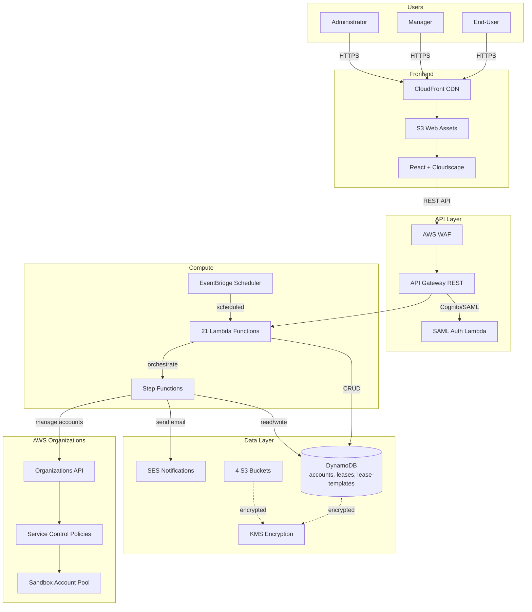
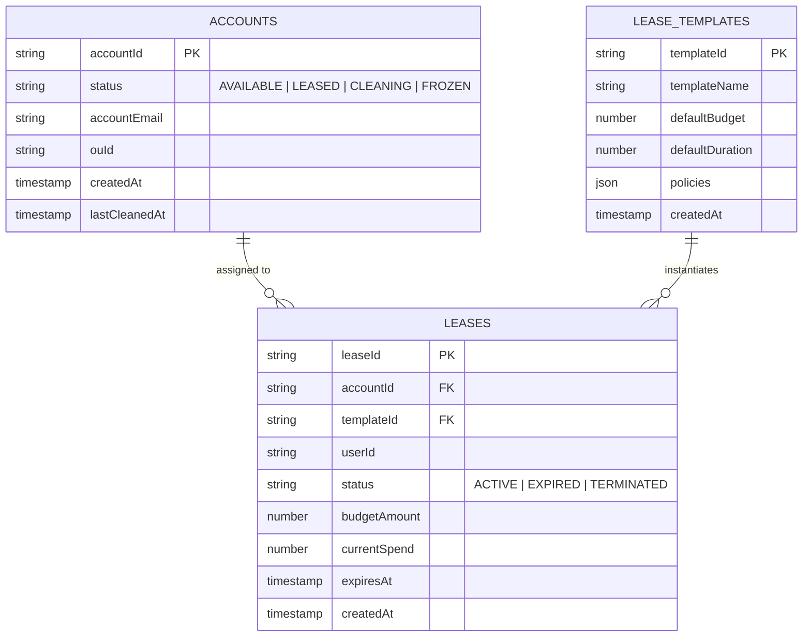
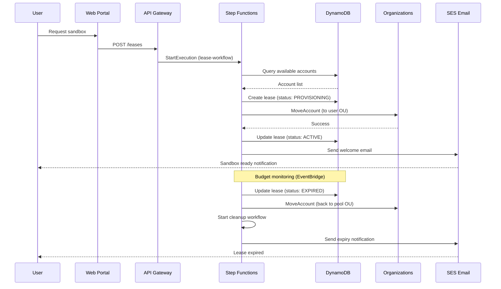
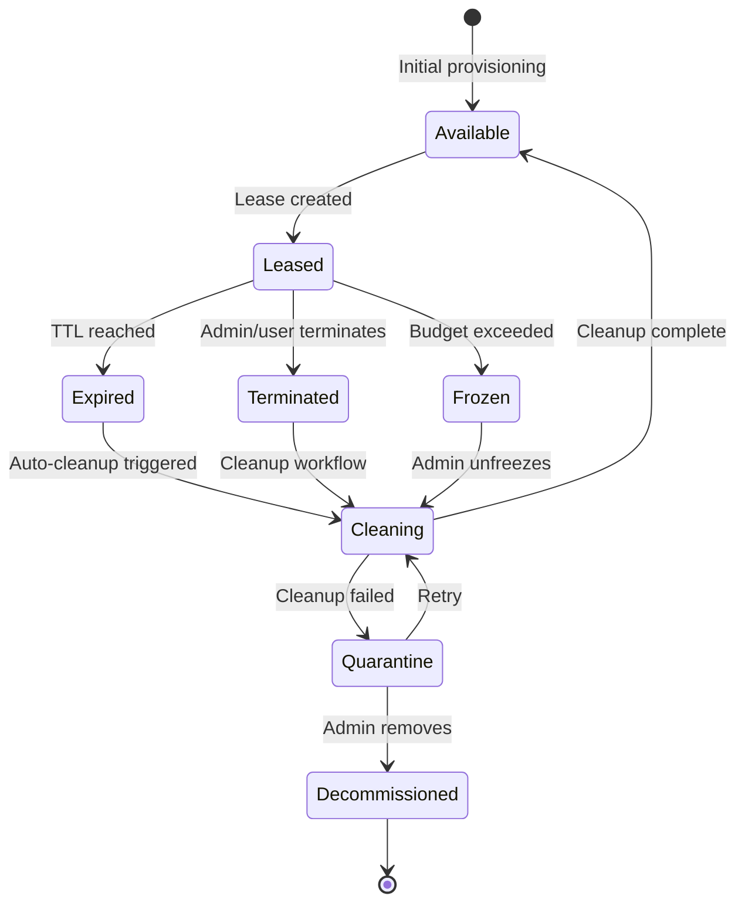
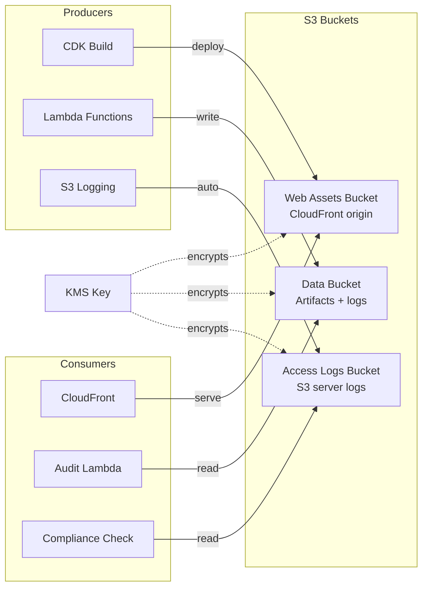
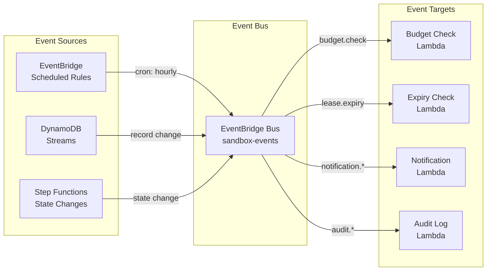

# Data Flow Architecture

End-to-end data flow through the Sandbox for AWS platform: DynamoDB tables, S3 buckets, SES emails, and EventBridge events.

## System Data Flow

## DynamoDB Data Model

## Lease Lifecycle Sequence

## Account Cleanup State Machine

## S3 Data Flow

## Event-Driven Architecture

