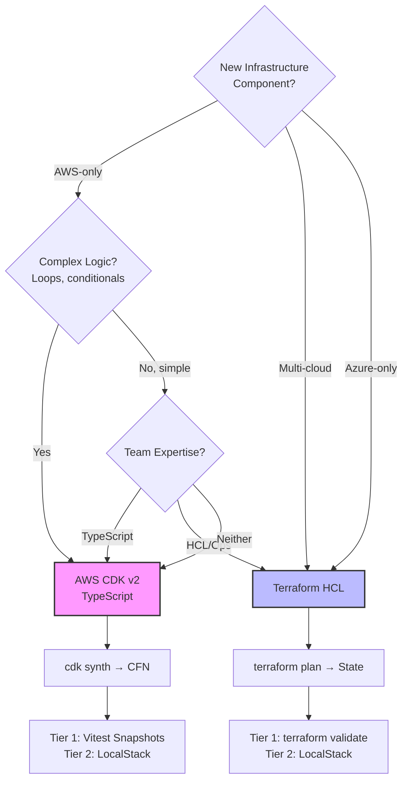
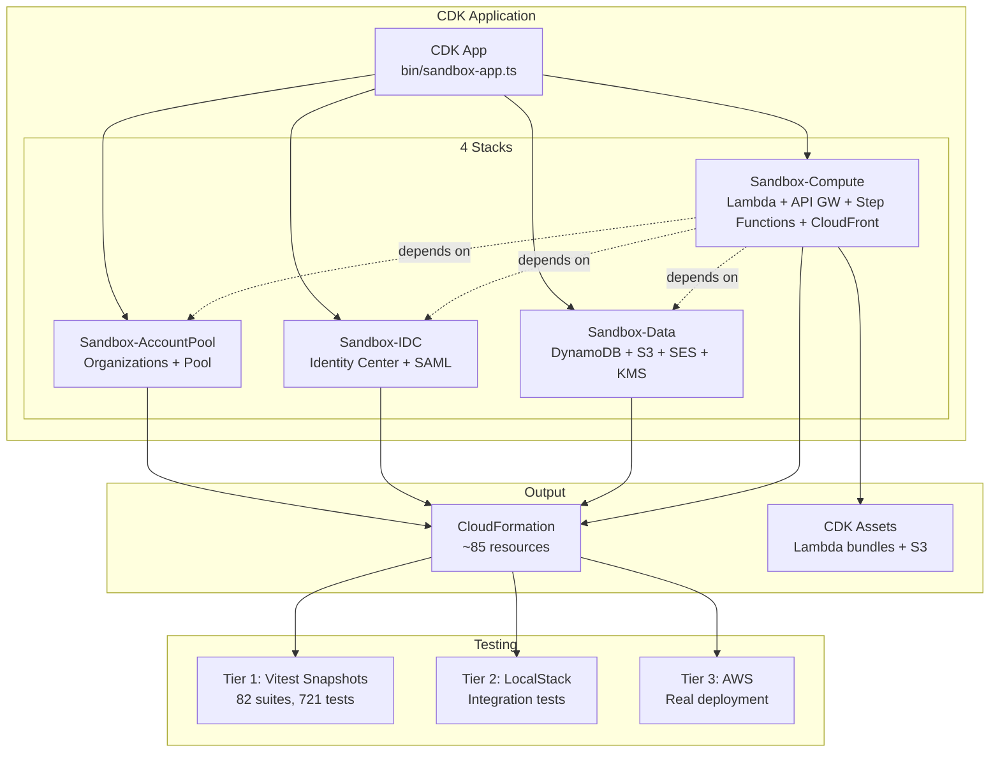
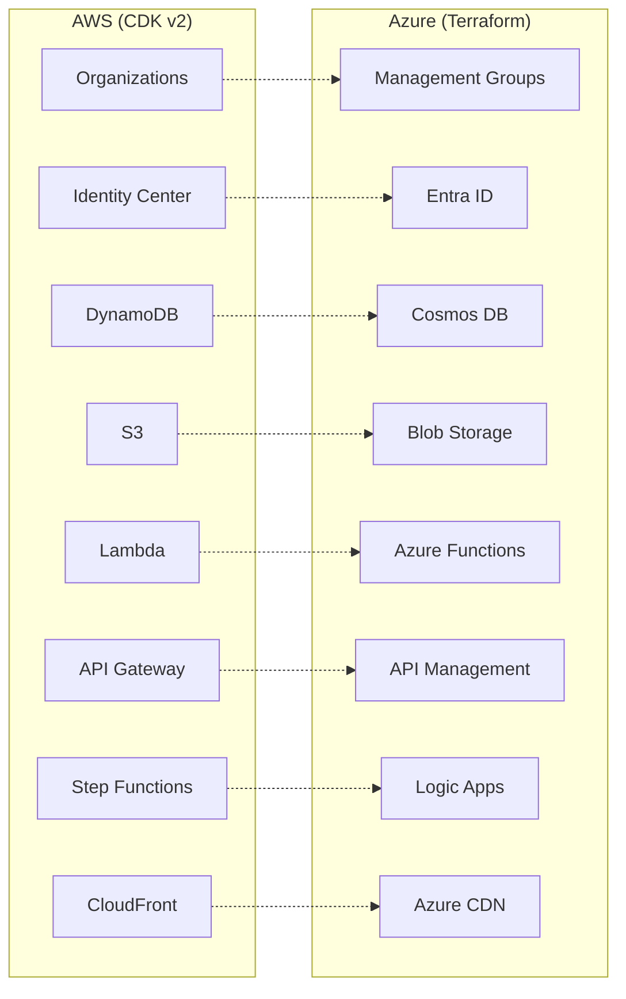
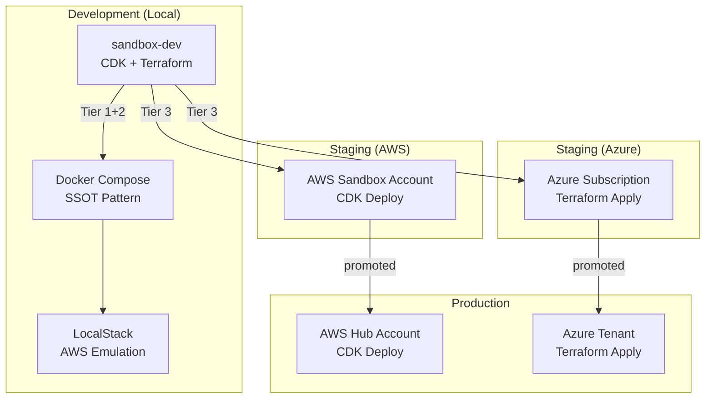

# Multi-Cloud Architecture

Sandbox for AWS supports multi-cloud enterprise patterns: AWS (CDK) + Azure (Terraform) + local Docker development.

## Decision Framework

```mermaid
quadrantChart
    title IaC Tool Selection
    x-axis Low Maturity --> High Maturity
    y-axis Low Complexity --> High Complexity
    quadrant-1 CDK (TypeScript)
    quadrant-2 Pulumi
    quadrant-3 Terraform (HCL)
    quadrant-4 CloudFormation
    AWS CDK v2: [0.8, 0.75]
    Terraform: [0.85, 0.5]
    Pulumi: [0.5, 0.7]
    CloudFormation: [0.9, 0.3]
    ARM Templates: [0.6, 0.4]
    Bicep: [0.55, 0.55]
```

## CDK vs Terraform Decision Tree



## AWS CDK Architecture (Current)



## Azure Terraform Migration Path

For organizations extending to Azure, the infrastructure pattern maps as follows:



## AWS-to-Azure Service Mapping

| AWS Service | Azure Equivalent | IaC Tool | Notes |
|-------------|-----------------|----------|-------|
| Organizations | Management Groups | Terraform | Multi-tenant hierarchy |
| IAM Identity Center | Entra ID (Azure AD) | Terraform | SAML/OIDC SSO |
| DynamoDB | Cosmos DB | Terraform | Serverless NoSQL |
| S3 | Blob Storage | Terraform | Object storage |
| Lambda | Azure Functions | Terraform | Serverless compute |
| API Gateway | API Management | Terraform | REST API facade |
| Step Functions | Logic Apps / Durable Functions | Terraform | Workflow orchestration |
| CloudFront | Azure CDN / Front Door | Terraform | CDN + WAF |
| KMS | Azure Key Vault | Terraform | Encryption keys |
| SES | SendGrid / Communication Services | Terraform | Email delivery |
| EventBridge | Event Grid | Terraform | Event routing |
| CloudWatch | Azure Monitor | Terraform | Observability |

## Deployment Patterns



## Key Architecture Decisions

| Decision | Choice | Rationale |
|----------|--------|-----------|
| Primary IaC | CDK v2 (TypeScript) | Type-safe, 4 stacks, 85 resources, existing codebase |
| Secondary IaC | Terraform (HCL) | Multi-cloud, Azure support, broader ecosystem |
| Package Manager | npm (Node.js) + uv (Python) | CDK is TypeScript-native; diagrams uses Python |
| Testing | Vitest (CDK) + terraform test (HCL) | Native testing per tool |
| Documentation | Docusaurus + MkDocs | GitHub Pages / Cloudflare deploy |
