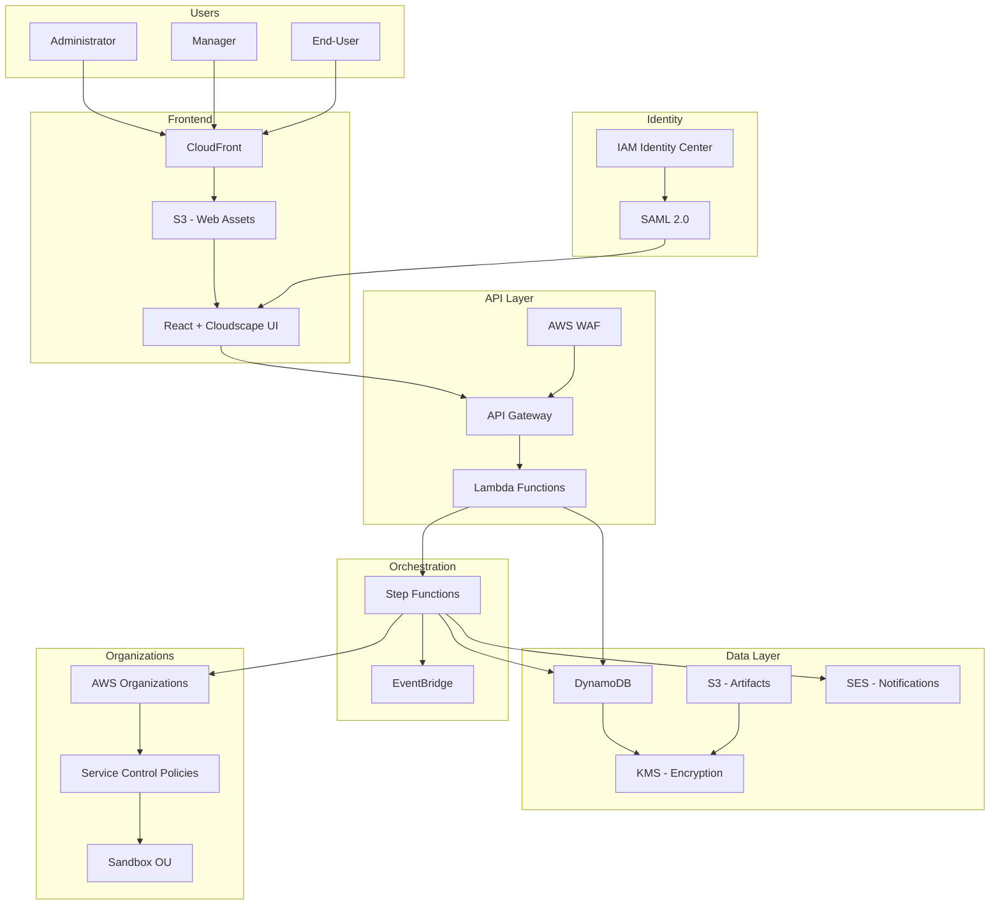
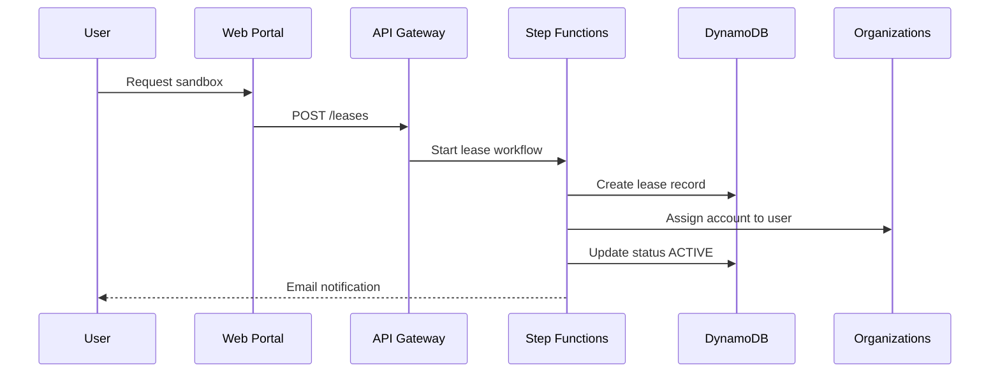

# Architecture Overview

Sandbox for AWS is a multi-account management platform built on AWS CDK v2.

## High-Level Architecture

## Design Principles

| Principle | Implementation |
|-----------|---------------|
| **Least Privilege** | IAM roles with minimum permissions per function |
| **Defense in Depth** | WAF + SCPs + IAM + KMS encryption |
| **Serverless-First** | Lambda, DynamoDB, Step Functions (no EC2) |
| **Event-Driven** | EventBridge for decoupled communication |
| **Infrastructure as Code** | CDK v2 with TypeScript |

## Component Interaction

## Generated Architecture Diagrams

Enterprise architecture with AWS cloud icons (generated via `task diagrams:generate`):

## Reference Diagrams (Legacy)

The following DrawIO diagrams from the upstream project are available in `/static/diagrams/architecture/`:

- `high-level.drawio.svg` — Original high-level architecture
- `in-depth.drawio.svg` — Detailed component diagram
- `stack-dependencies.drawio.svg` — Stack dependency graph
- `stack-relationships.drawio.svg` — Inter-stack relationships
