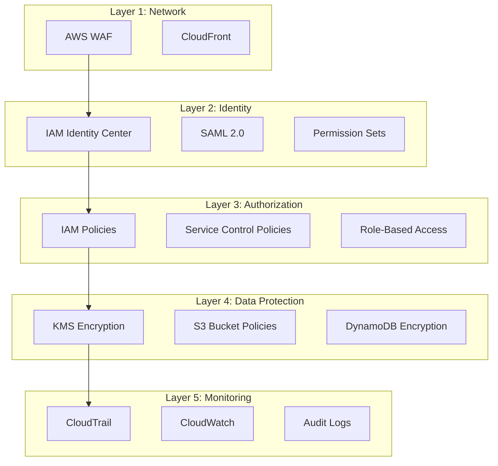

# Security Controls

Sandbox for AWS implements defense-in-depth security across multiple layers.

## Security Layers



## Service Control Policies

SCPs applied to the Sandbox OU restrict user actions:

### Region Restriction

```json
{
  "Version": "2012-10-17",
  "Statement": [{
    "Sid": "DenyOutsideHomeRegion",
    "Effect": "Deny",
    "Action": "*",
    "Resource": "*",
    "Condition": {
      "StringNotEquals": {
        "aws:RequestedRegion": ["ap-southeast-2"]
      },
      "ArnNotLike": {
        "aws:PrincipalARN": "arn:aws:iam::*:role/Sandbox-*"
      }
    }
  }]
}
```

### Deny Dangerous Actions

```json
{
  "Version": "2012-10-17",
  "Statement": [{
    "Sid": "DenyDangerousActions",
    "Effect": "Deny",
    "Action": [
      "organizations:LeaveOrganization",
      "account:CloseAccount",
      "iam:CreateUser",
      "iam:CreateAccessKey"
    ],
    "Resource": "*"
  }]
}
```

## KMS Encryption

All data at rest is encrypted with KMS keys:

| Resource | Encryption |
|----------|-----------|
| DynamoDB tables | AWS-managed KMS |
| S3 buckets | Customer-managed KMS (SSE-KMS) |
| CloudWatch Logs | KMS encryption |
| SES | TLS in transit |

## IAM Least Privilege

Each Lambda function has its own IAM role with minimum required permissions. No function has `*` resource access.
