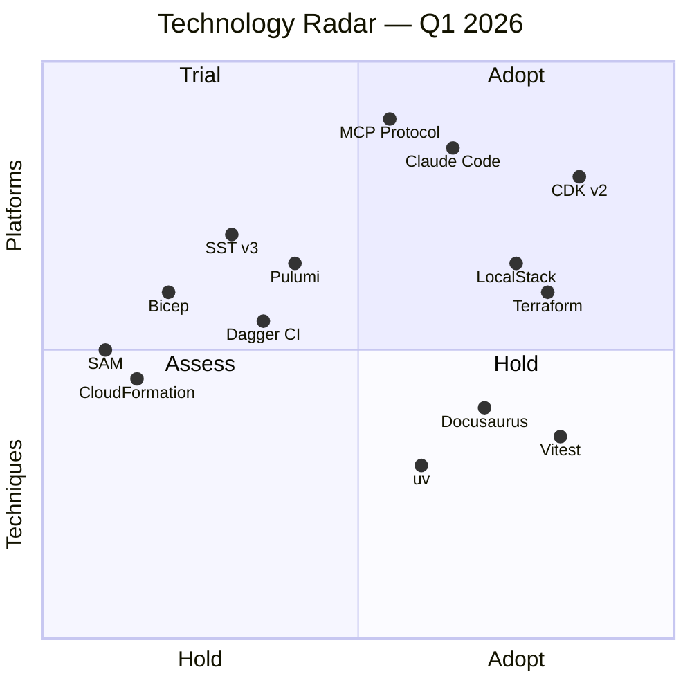
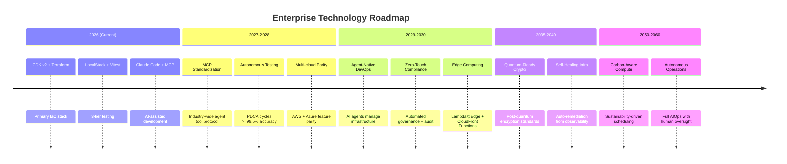

# Technology Radar 2026-2060

Enterprise technology evaluation following the ThoughtWorks Technology Radar methodology. Updated quarterly.

:::info Update Cadence
This radar is reviewed every quarter (Q1 Jan, Q2 Apr, Q3 Jul, Q4 Oct). Last updated: **Q1 2026**.
:::

## Radar Overview

## Adopt (Use in production)

| Technology | Category | Why |
|------------|----------|-----|
| **AWS CDK v2** | IaC | Type-safe, L2/L3 constructs, 4 stacks in production |
| **Terraform** | IaC | Multi-cloud (Azure), mature ecosystem, state management |
| **Vitest** | Testing | Fast snapshot tests (721 tests in 2-3s), Vite-native |
| **Docker Compose** | Platform | SSOT pattern, local-first development |
| **TypeScript** | Language | 98.6% of codebase, CDK + frontend + Lambda |
| **React + Cloudscape** | Frontend | AWS-native UI, enterprise design system |

## Trial (Use with caution, evaluate in real projects)

| Technology | Category | Why |
|------------|----------|-----|
| **LocalStack** | Testing | Tier 2 integration tests, free AWS emulation |
| **Docusaurus** | Docs | 42 pages, Mermaid support, search plugin |
| **Claude Code + MCP** | AI/DevX | Agent orchestration, 8 MCP servers configured |
| **uv** | Tooling | 10-100x faster than pip, pyproject.toml standard |
| **Python diagrams** | Docs | Programmatic AWS architecture diagrams |
| **Playwright** | Testing | E2E browser testing with screenshot evidence |

## Assess (Explore, understand trade-offs)

| Technology | Category | Potential |
|------------|----------|-----------|
| **MCP Protocol** | AI/DevX | Standardized tool integration for AI agents |
| **Pulumi** | IaC | General-purpose languages for IaC (TypeScript) |
| **Dagger CI** | CI/CD | Container-native CI pipelines |
| **SST v3** | IaC | Serverless-optimized, live Lambda dev |
| **Checkov** | Security | Policy-as-code for CloudFormation |

## Hold (Do not start new projects with)

| Technology | Category | Why |
|------------|----------|-----|
| **CloudFormation (raw)** | IaC | CDK generates better CFN; direct authoring is verbose |
| **SAM** | IaC | Replaced by CDK for Lambda management |
| **Bicep** | IaC | Azure-only; Terraform preferred for multi-cloud |
| **requirements.txt** | Python | Replaced by pyproject.toml + uv |
| **pip** | Python | Replaced by uv (10-100x faster) |
| **Jest** | Testing | Replaced by Vitest (faster, ESM-native) |

## 2026-2060 Technology Trajectory

## Evaluation Criteria

Each technology is evaluated against 5 dimensions:

| Dimension | Weight | Description |
|-----------|--------|-------------|
| **Maturity** | 25% | Production readiness, community size, LTS |
| **Enterprise Fit** | 25% | Compliance, security, multi-tenant support |
| **Developer Experience** | 20% | Tooling, documentation, onboarding time |
| **Cost** | 15% | License, infrastructure, operational overhead |
| **Future-Proof** | 15% | Roadmap alignment, vendor lock-in risk |

## Quarterly Review Process

1. **Collect signals** from team usage, industry trends, and security advisories
2. **Evaluate** each technology against the 5 dimensions above
3. **Update radar** placement (Adopt/Trial/Assess/Hold)
4. **Document** rationale for any movement between quadrants
5. **Communicate** changes to all engineering teams
