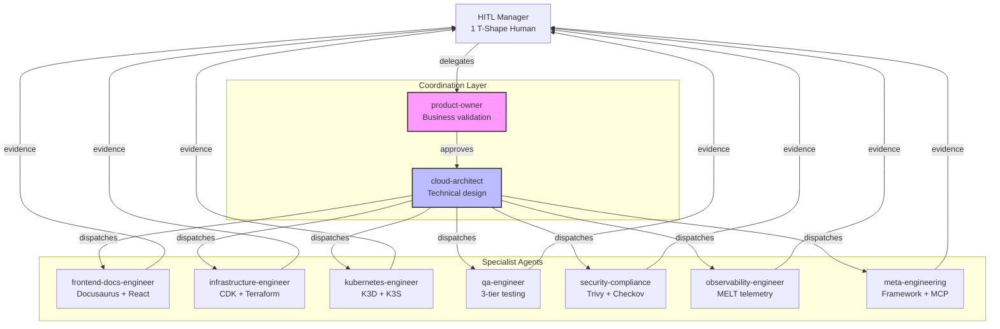
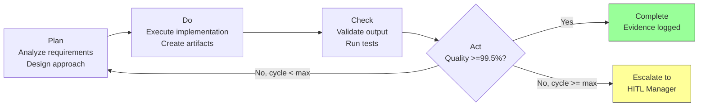
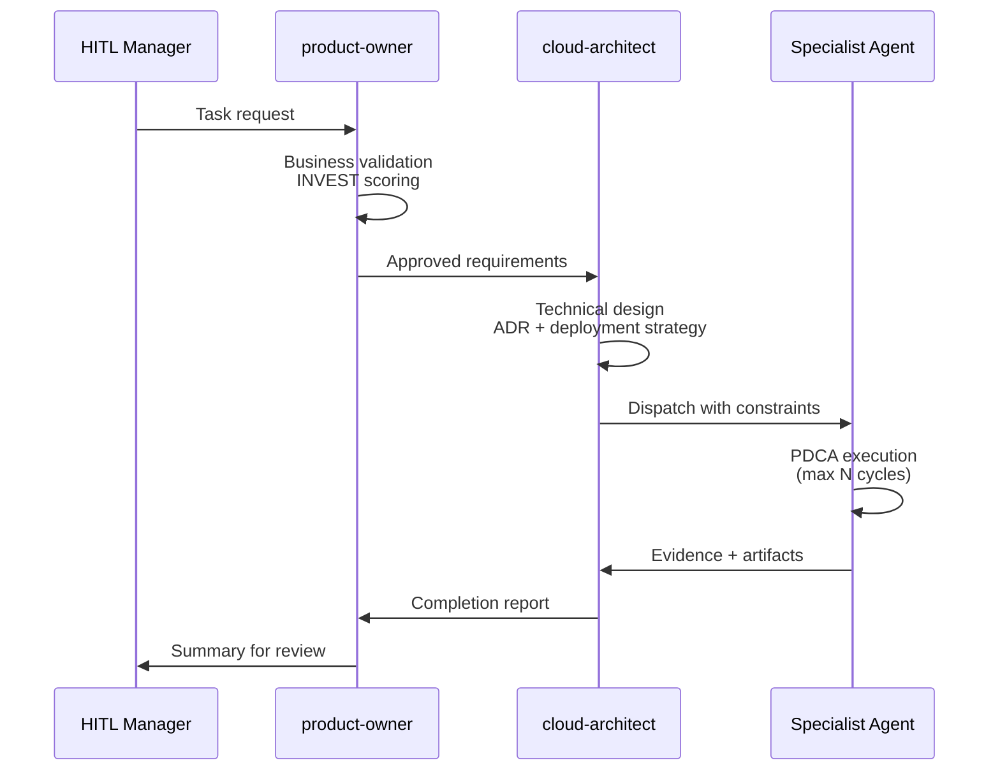

# ADLC Framework v3.2.0

The Agent Development Lifecycle (ADLC) is an enterprise coordination framework for AI-assisted software development. It manages a team of 9 specialized agents orchestrated by a single HITL (Human-In-The-Loop) manager.

## Agent Coordination Flow



## PDCA Autonomous Cycle

Every agent task follows the Plan-Do-Check-Act cycle with configurable limits:



### PDCA Cycle Limits

| Context | Max Cycles | Escalation |
|---------|-----------|------------|
| Tier 1+2 Testing | 3 | HITL review |
| Full Test Suite | 7 | HITL review |
| Framework Changes | 5 | HITL approval |
| Diagram Generation | 3 | HITL review |

## Framework Components

| Component | Count | Location |
|-----------|-------|----------|
| Agents | 9 | `.claude/agents/` |
| Commands | 77 | `.claude/commands/` |
| Skills | 125 | `.claude/skills/` |
| Templates | 6 | `.claude/templates/` |
| Rules | 4 | `.claude/rules/` |

### Agent Roster

| Agent | Role | Primary Skills |
|-------|------|---------------|
| **product-owner** | Business validation, requirements | INVEST scoring, 5W1H analysis |
| **cloud-architect** | Technical design, deployment | AWS Well-Architected, ADRs |
| **frontend-docs-engineer** | UI + documentation | Docusaurus, React, Cloudscape |
| **infrastructure-engineer** | IaC implementation | CDK TypeScript, Terraform HCL |
| **kubernetes-engineer** | Container orchestration | K3D (Docker), K3S (SSH) |
| **qa-engineer** | Quality assurance | 3-tier testing, cross-validation |
| **security-compliance** | Security + governance | Trivy, Checkov, CDK Nag |
| **observability-engineer** | Monitoring + telemetry | MELT, SLOs, error budgets |
| **meta-engineering** | Framework extension | MCP servers, agent design |

### Command Categories

| Category | Count | Examples |
|----------|-------|---------|
| `cdk:*` | 12 | `cdk:synth`, `cdk:deploy`, `cdk:test` |
| `terraform:*` | 12 | `terraform:deploy`, `terraform:test` |
| `finops:*` | 10 | `finops:aws-monthly`, `finops:analyze` |
| `docs:*` | 3 | `docs:validate`, `docs:cross-validate` |
| `security:*` | 2 | `security:sast`, `security:prompt-injection` |
| `k3d:*` / `k3s:*` | 12 | `k3d:deploy`, `k3s:test` |
| `speckit.*` | 10 | `speckit.specify`, `speckit.implement` |
| Other | 16 | `mcp:validate`, `platform:bootstrap` |

## Enterprise Coordination Protocol

The coordination protocol is **BLOCKING** — no specialist can execute without prior approval:



### Anti-Patterns (BLOCKED)

| Anti-Pattern | Description | Detection |
|-------------|-------------|-----------|
| `STANDALONE_EXECUTION` | Specialist executes without coordination | No `product-owner-*.json` in evidence |
| `NATO_VIOLATION` | Claims completion without evidence | No files in `tmp/` |
| `SKIP_EVIDENCE` | Completes without artifacts | Missing evidence path |

## Evidence Structure

All agent work produces evidence in standardized paths:

```
tmp/aws-sandbox/
├── coordination-logs/          # Agent coordination
│   ├── product-owner-YYYY-MM-DD.json
│   └── cloud-architect-YYYY-MM-DD.json
├── test-results/               # Test execution
│   ├── tier1/
│   ├── tier2/
│   └── tier3/
├── evidence/                   # Final evidence
│   └── feature-name-YYYY-MM-DD.md
└── research/                   # Research outputs
    └── RQ*-answer-YYYY-MM-DD.md
```

## MCP Integration

The framework leverages 8 MCP servers for real-time AWS API access:

| MCP Server | Purpose |
|------------|---------|
| `awslabs.cdk-toolkit` | CDK Nag checks, best practices |
| `awslabs.cloudformation` | Template validation |
| `awslabs.iam` | Policy analysis, SCP validation |
| `awslabs.cost-explorer` | FOCUS 1.3 cost tracking |
| `awslabs.lambda-tool` | Function debugging |
| `awslabs.cloudwatch` | Metrics, logs, alarms |
| `awslabs.terraform-mcp` | Registry integration |
| `playwright-automation` | E2E testing + screenshots |
