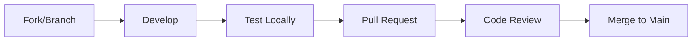

# Contributing

Guidelines for contributing to Sandbox for AWS.

## Development Workflow



## Setup

1. Clone the repository:
```bash
git clone https://github.com/nnthanh101/aws-sandbox.git
cd aws-sandbox
```

2. Start the development environment:
```bash
task docker:start
```

3. Install dependencies:
```bash
docker exec sandbox-dev npm install
```

4. Run tests to verify setup:
```bash
task test:tier1:docker
```

## Code Standards

| Area | Tool | Command |
|------|------|---------|
| TypeScript | ESLint + Prettier | `npm run lint` |
| CDK | Snapshot tests | `task test:tier1:docker` |
| Security | Trivy + Checkov | `task security:scan` |
| Legal | License headers | `task legal:audit` |

## Pull Request Checklist

Before submitting a PR:

- [ ] Tier 1 snapshot tests pass (`task test:tier1:docker`)
- [ ] Tier 2 LocalStack tests pass (`task test:tier2:docker`)
- [ ] Frontend tests pass (`task test:frontend:docker`)
- [ ] No security scan findings (`task security:scan`)
- [ ] License headers present on modified files
- [ ] Documentation updated if API changed

## License Headers

Files derived from the upstream Innovation Sandbox on AWS codebase must retain the Amazon copyright:

```typescript
// Copyright Amazon.com, Inc. or its affiliates. All Rights Reserved.
// SPDX-License-Identifier: Apache-2.0
```

New original files (tests, configuration, documentation) do **not** receive the Amazon copyright header.

## Branch Naming

| Type | Pattern | Example |
|------|---------|---------|
| Feature | `feature/description` | `feature/budget-alerts` |
| Bug fix | `fix/description` | `fix/cleanup-timeout` |
| Docs | `docs/description` | `docs/workshop-guide` |

## Commit Messages

Follow conventional commits:

```
feat: add budget alert notifications
fix: resolve account cleanup timeout
docs: update workshop deploy guide
chore: upgrade CDK to v2.170
```
