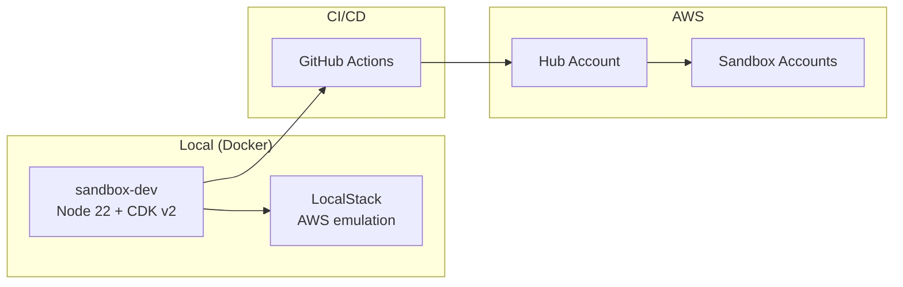
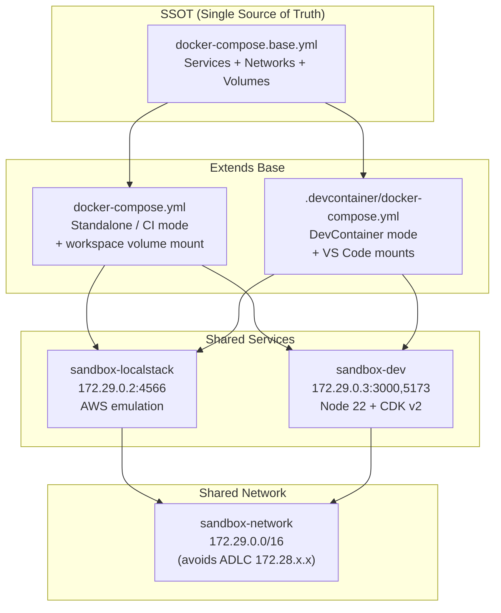
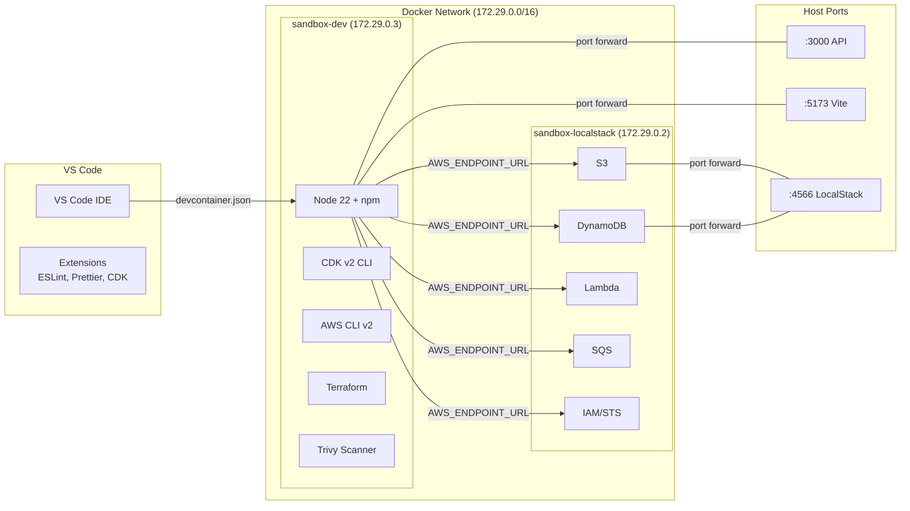

# Local-First Development

Sandbox for AWS follows a Local-First Hybrid-Cloud pattern: develop and test locally using Docker, then deploy to AWS.

## Architecture



## Quick Start

```bash
# Start containers
task docker:start

# Verify environment
task docker:status

# Run tests
task test:tier1:docker    # Snapshot tests (2-3s)
task test:tier2:docker    # LocalStack tests (30-60s)

# Start frontend dev server
task frontend:dev         # http://localhost:5173

# Start documentation
task docs:dev             # http://localhost:3001
```

## Docker Services

| Service | Container | Port | Purpose |
|---------|-----------|------|---------|
| sandbox-dev | `sandbox-dev` | 3000, 5173-5179 | Development environment |
| LocalStack | `sandbox-localstack` | 4566 | AWS service emulation |

## SSOT Pattern

`docker-compose.base.yml` is the **Single Source of Truth** for all service configuration. It is extended by:

- `docker-compose.yml` — Standalone/production mode
- `.devcontainer/docker-compose.yml` — VS Code DevContainer mode



```bash
# Validate SSOT pattern
task compose:validate
```

## DevContainer Support

Open the project in VS Code and select **Reopen in Container** to get a fully configured development environment:

- Node.js 22 with CDK v2 and AWS CLI v2
- LocalStack for AWS service emulation
- Terraform, Trivy, Checkov pre-installed
- Port forwarding configured automatically



## Environment Variables

Key environment variables are configured in `docker-compose.base.yml`:

| Variable | Default | Purpose |
|----------|---------|---------|
| `AWS_DEFAULT_REGION` | `ap-southeast-2` | AWS region |
| `CDK_DEFAULT_ACCOUNT` | `000000000000` | CDK target account |
| `LOCALSTACK_ENDPOINT` | `http://localstack:4566` | LocalStack URL |
| `INFRACOST_API_KEY` | (empty) | Optional cost estimation |
