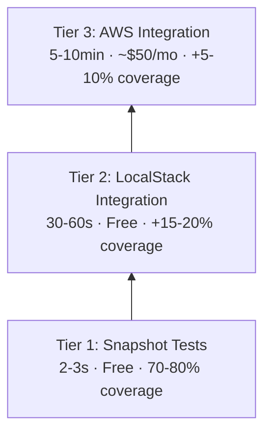

# Testing Tiers

Sandbox for AWS uses a 3-tier testing strategy that maximizes test coverage while minimizing cost.

## Testing Pyramid



## Tier 1: Snapshot Tests

**Duration**: 2-3 seconds | **Cost**: Free | **Coverage**: 70-80%

CDK snapshot tests verify that CloudFormation templates match expected output.

```bash
task test:tier1:docker
```

What Tier 1 catches:
- CDK construct configuration errors
- Missing IAM permissions
- Incorrect resource properties
- Unintended template changes

### Updating Snapshots

When you intentionally change infrastructure:

```bash
docker exec sandbox-dev npm test -- --update
```

## Tier 2: LocalStack Integration

**Duration**: 30-60 seconds | **Cost**: Free | **Coverage**: +15-20%

Integration tests deploy to LocalStack and verify resource creation.

```bash
task test:tier2:docker
```

What Tier 2 catches:
- DynamoDB table creation issues
- S3 bucket policy errors
- Lambda function deployment problems
- Step Functions execution logic

### LocalStack Services

| Service | Fidelity | Notes |
|---------|----------|-------|
| DynamoDB | High | Full API support |
| S3 | High | Including bucket policies |
| Lambda | Medium | Limited runtime support |
| Step Functions | Medium | Basic execution |
| IAM | Medium | Policy evaluation |
| CloudFormation | Medium | Resource creation |

## Tier 3: AWS Integration

**Duration**: 5-10 minutes | **Cost**: ~$50/month | **Coverage**: +5-10%

Real AWS deployment tests in a dedicated test account.

```bash
task test:tier3
```

What Tier 3 catches:
- AWS service limits and quotas
- Cross-account IAM trust relationships
- SCP behavior in Organizations
- SES email delivery
- Identity Center SAML flow

:::note
Tier 3 requires valid AWS credentials and costs real money. Use sparingly and in CI/CD only.
:::

## Frontend Tests

```bash
task test:frontend:docker
```

Frontend tests use Vitest for unit tests and can use Playwright for E2E browser tests.

## Evidence

All test results are captured to `tmp/aws-sandbox/test-results/`:

```
tmp/aws-sandbox/test-results/
├── tier1/
│   └── 2024-01-15-143025.log
├── tier2/
│   └── 2024-01-15-143200.log
└── frontend/
    └── 2024-01-15-143500.log
```
