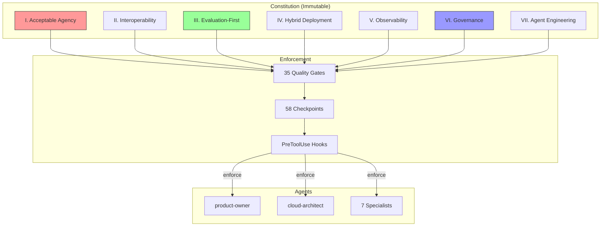
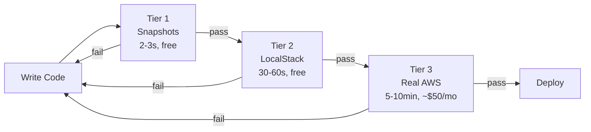
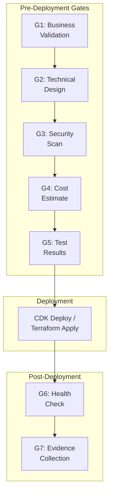

# ADLC Constitution v1.2.0

The Agent Development Lifecycle Constitution defines 7 non-negotiable principles with 58 checkpoints that govern all agent behavior in the Sandbox for AWS project.

## Constitutional Governance Model



## The 7 Principles

### Principle I: Acceptable Agency

**HITL approval required** for actions with irreversible consequences.

| Action | Approval Required | Rationale |
|--------|------------------|-----------|
| `git commit/push` | Always | Version control authority = HITL |
| AWS deployment (Tier 3) | Always | Real infrastructure cost |
| Cost > $100/month | Always | Budget governance |
| npm publish | Always | Public package release |
| File creation/edit | Automatic | Reversible, local-only |
| Test execution | Automatic | Safe, idempotent |

### Principle II: Interoperability

Standard protocols and least-privilege access.

- **MCP Protocol** for all tool integrations (8 servers configured)
- **OAuth / SAML 2.0** for identity (IAM Identity Center)
- **Least privilege** IAM roles per Lambda function
- **SPDX** license identifiers in all source files

### Principle III: Evaluation-First

Test before deploy. Measure before claiming.



**Targets**:
- Code coverage: 100% for new code
- Agent behavior quality: >=95%
- MCP cross-validation accuracy: >=99.5%

### Principle IV: Hybrid Deployment

Local-first, cloud-second. Three deployment tiers.

| Tier | Environment | Cost | Use Case |
|------|------------|------|----------|
| Local | Docker + LocalStack | $0 | Daily development |
| Staging | AWS Sandbox Account | ~$50/mo | Pre-production validation |
| Production | AWS Hub Account | Variable | Live enterprise platform |

### Principle V: Observability

MELT telemetry — Metrics, Events, Logs, Traces.

- All agent actions logged to `tmp/aws-sandbox/`
- Test results captured with timestamps
- Evidence files required for completion claims
- CloudWatch metrics for production monitoring

### Principle VI: Governance

Constitutional checkpoints before deployment.



### Principle VII: Agent Engineering

Orchestrator pattern — agents are small (50-100 LOC), focused, composable.

| Constraint | Value | Rationale |
|-----------|-------|-----------|
| Agent size | 50-100 LOC | Keep focused, avoid monolith agents |
| Skill reuse | Composition over inheritance | Share via skill references |
| PDCA limit | 3-7 cycles | Prevent infinite loops |
| Evidence | Required | No NATO (No Action, Talk Only) |

## Checkpoint Matrix

| # | Checkpoint | Principle | Severity |
|---|-----------|-----------|----------|
| 1 | HITL approval for git operations | I | BLOCKING |
| 2 | HITL approval for deployments | I | BLOCKING |
| 3 | HITL approval for cost > $100/mo | I | BLOCKING |
| 4 | MCP protocol for tool integration | II | HIGH |
| 5 | SPDX license headers | II | MEDIUM |
| 6 | Tier 1 tests pass | III | BLOCKING |
| 7 | Tier 2 tests pass (pre-deploy) | III | HIGH |
| 8 | Cross-validation >=99.5% | III | HIGH |
| 9 | Docker-first development | IV | HIGH |
| 10 | LocalStack for integration tests | IV | HIGH |
| 11 | Evidence in tmp/ path | V | BLOCKING |
| 12 | Coordination logs present | V | BLOCKING |
| 13 | Security scan clean | VI | HIGH |
| 14 | Cost estimate approved | VI | HIGH |
| 15 | Agent under 100 LOC | VII | MEDIUM |

:::note
The full 58-checkpoint matrix is maintained in `.specify/memory/constitution.md`. This page shows the top 15 critical checkpoints.
:::

## Compliance Validation

Run constitutional compliance checks:

```bash
# Validate all constitutional checkpoints
speckit.constitution:validate

# Lint framework files
speckit.constitution:lint

# Enforce for current session
speckit.constitution:enforce
```
