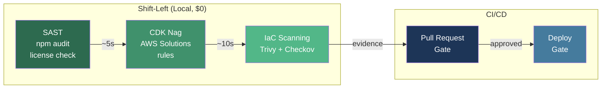

# Security Policy

## Reporting Vulnerabilities

If you discover a security vulnerability in Sandbox for AWS, please report it responsibly.

**Do NOT open a public GitHub issue for security vulnerabilities.**

Instead, report via:
1. GitHub Security Advisories (preferred)
2. Email to the repository maintainers

## Security Controls

See [Security Controls](/docs/architecture/security-controls) for the full defense-in-depth architecture.

### Summary

| Layer | Controls |
|-------|----------|
| Network | AWS WAF, CloudFront, VPC |
| Identity | IAM Identity Center, SAML 2.0 |
| Authorization | IAM policies, SCPs, RBAC |
| Data | KMS encryption at rest, TLS in transit |
| Monitoring | CloudTrail, CloudWatch, audit logs |

## DevSecOps Scanning Pipeline

The security scanning pipeline follows a shift-left approach — fastest and cheapest scans run first:



### Local Security Tasks

| Task | Duration | What It Checks |
|------|----------|---------------|
| `task security:sast` | ~5s | npm audit, license compliance, TypeScript strict mode |
| `task security:cdknag` | ~10s | AWS Solutions rules against synthesized CloudFormation |
| `task security:scan` | ~30s | Trivy IaC config + Checkov CloudFormation best practices |

```bash
# Run full pipeline (shift-left order)
task security:sast && task security:cdknag && task security:scan

# Individual scans
task security:sast       # SAST (dependency + license)
task security:cdknag     # CDK Nag (build-time rules)
task security:scan       # Trivy + Checkov (IaC)
```

Evidence saved to `tmp/aws-sandbox/security-reports/`.

## Dependency Management

- Dependencies are pinned in `package-lock.json`
- Regular `npm audit` checks for known vulnerabilities
- Trivy scans container images and IaC templates
- Checkov validates CloudFormation security best practices

## Secure Development

### Code Review Requirements

- All changes require pull request review
- Security-sensitive changes require additional reviewer
- Automated security scanning in CI/CD pipeline

### Secret Management

- No secrets in source code or environment files
- Use AWS Secrets Manager or SSM Parameter Store
- `.env` files are gitignored
- IAM roles used instead of access keys where possible

## Compliance

Sandbox for AWS supports enterprise compliance requirements:

| Framework | Support |
|-----------|---------|
| SOX | Audit logging, access controls |
| PCI-DSS | Encryption, network isolation |
| GDPR | Data retention policies, access controls |
| HIPAA | Encryption at rest and in transit |
