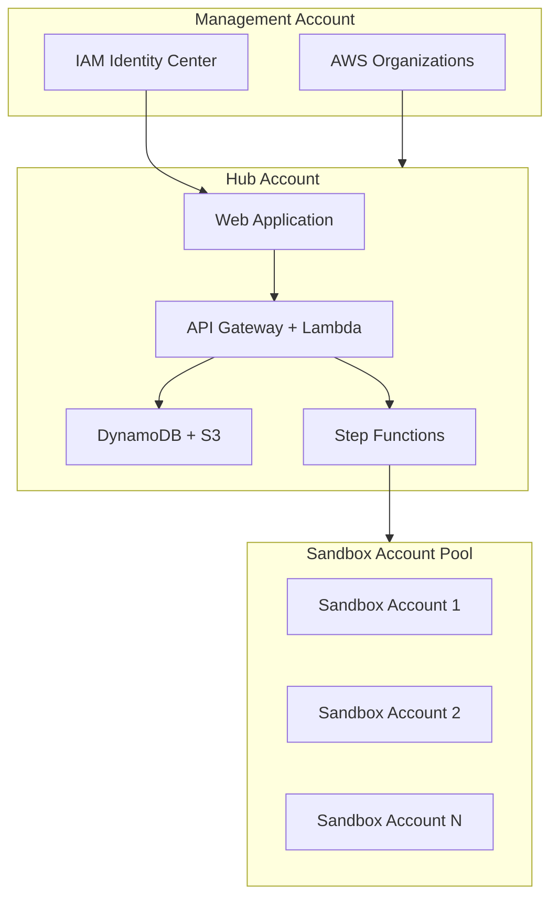

# Key Concepts & Glossary

Core concepts and terminology used throughout Sandbox for AWS.

## Architecture Concepts

## Glossary

| Term | Definition |
|------|-----------|
| **Hub Account** | The central AWS account where Sandbox for AWS infrastructure is deployed. Hosts the web application, API, databases, and orchestration. |
| **Management Account** | The AWS Organizations management account. Used for IAM Identity Center configuration and organizational unit management. |
| **Sandbox Account** | An isolated AWS account provisioned for temporary use. All resources are deleted when the lease expires. |
| **Account Pool** | Collection of pre-provisioned sandbox accounts available for lease assignment. Managed by the AccountPool stack. |
| **Lease** | A time-bound assignment of a sandbox account to a user. Leases have a start date, expiry date, budget limit, and status. |
| **Lease Duration** | Maximum time a sandbox account can be used. Configurable per-role (default: 7 days for users, 30 days for managers). |
| **Budget Limit** | Maximum AWS spend allowed per lease. Enforced via AWS Budgets. Exceeding the limit triggers automatic lease termination. |
| **Service Control Policy (SCP)** | AWS Organizations policy restricting what actions can be performed in sandbox accounts. Prevents privilege escalation and limits regions/services. |
| **Cleanup State Machine** | AWS Step Functions workflow that sanitizes a sandbox account after lease expiry. Deletes all resources and returns the account to the pool. |
| **Organizational Unit (OU)** | AWS Organizations container for grouping accounts. Sandbox for AWS uses a dedicated OU with SCPs attached. |
| **SAML Application** | IAM Identity Center application providing single sign-on to the Sandbox for AWS web portal. |
| **Permission Set** | IAM Identity Center construct mapping Identity Center groups to IAM roles in sandbox accounts. |
| **Home Region** | The primary AWS region where the solution is deployed. Default: `ap-southeast-2`. All stacks must be in the same region. |
| **Nuke / Account Cleanup** | Process of deleting all customer-created resources in a sandbox account to return it to a clean state. |
| **Guardrails** | Combination of SCPs, IAM policies, and AWS Config rules that restrict sandbox account usage to safe boundaries. |

## Role Model

| Role | Identity Center Group | Capabilities |
|------|----------------------|-------------|
| **Administrator** | `SandboxAdmins` | Full platform management, account registration, SCP configuration |
| **Manager** | `SandboxManagers` | Approve/deny requests, extend leases, view reports |
| **End-User** | `SandboxUsers` | Request sandbox accounts, view lease status, access sandbox console |

## CDK Stack Naming

| Stack ID | CloudFormation Name | Purpose |
|----------|-------------------|---------|
| `Sandbox-AccountPool` | Account pool lifecycle | Manages sandbox account provisioning and OU assignment |
| `Sandbox-IDC` | IAM Identity Center | SAML application, permission sets, role mapping |
| `Sandbox-Data` | Data layer | DynamoDB tables, S3 buckets, SES email, EventBridge |
| `Sandbox-Compute` | Compute layer | Lambda functions, Step Functions, API Gateway, CloudFront, WAF |
