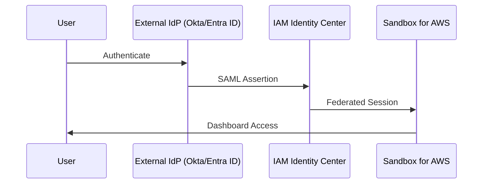

# External Identity Provider Setup

Configure Sandbox for AWS with an external Identity Provider (IdP) for enterprise SSO. Supports SAML 2.0 providers including Okta and Microsoft Entra ID (formerly Azure AD).

:::info When to Use
Use an external IdP when your organization already manages identities in Okta, Entra ID, or another SAML-compatible provider instead of IAM Identity Center's built-in directory.
:::

## Architecture



## Option A: Okta Integration

### Step 1: Configure SCIM Provisioning in Okta

1. In Okta Admin Console, navigate to **Applications** > **Browse App Catalog**
2. Search for **AWS IAM Identity Center**
3. Choose **Add Integration**
4. Configure SCIM provisioning:
   - **SCIM connector base URL**: Get from IAM Identity Center console > **Settings** > **Automatic provisioning**
   - **Access token**: Generate in IAM Identity Center console

### Step 2: Assign Groups in Okta

Create or map these groups in Okta:

| Okta Group | Maps To | Purpose |
|-----------|---------|---------|
| `AWS-SandboxAdmins` | `SandboxAdmins` | Platform administrators |
| `AWS-SandboxManagers` | `SandboxManagers` | Lease approval managers |
| `AWS-SandboxUsers` | `SandboxUsers` | End-users |

### Step 3: Push Groups to Identity Center

1. In the Okta application, go to **Push Groups**
2. Choose **Push Groups** > **Find groups by name**
3. Push all three groups
4. Verify groups appear in IAM Identity Center console

## Option B: Microsoft Entra ID Integration

### Step 1: Configure SCIM in Entra ID

1. In Azure Portal, navigate to **Microsoft Entra ID** > **Enterprise applications**
2. Choose **New application** > Search for **AWS IAM Identity Center**
3. Configure provisioning:
   - **Provisioning Mode**: Automatic
   - **Tenant URL**: SCIM endpoint from IAM Identity Center
   - **Secret Token**: Access token from IAM Identity Center

### Step 2: Create Security Groups in Entra ID

```
SandboxAdmins    → Assigned to Admin users
SandboxManagers  → Assigned to Manager users
SandboxUsers     → Assigned to all sandbox requestors
```

### Step 3: Configure Attribute Mapping

Ensure these attributes are mapped:

| Entra ID Attribute | Identity Center Attribute |
|-------------------|--------------------------|
| `userPrincipalName` | `userName` |
| `mail` | `emails[type eq "work"].value` |
| `givenName` | `name.givenName` |
| `surname` | `name.familyName` |
| `displayName` | `displayName` |

### Step 4: Start Provisioning

1. Choose **Start provisioning**
2. Wait for initial sync (typically 5-20 minutes)
3. Verify users and groups in IAM Identity Center console

## Verification

After configuring your external IdP:

1. **Verify groups synced**: Check IAM Identity Center > **Groups** for all three groups
2. **Verify users synced**: Check IAM Identity Center > **Users** for provisioned users
3. **Test sign-in**: Open the Sandbox for AWS portal URL and authenticate via your IdP
4. **Verify role assignment**: Confirm users see the correct dashboard (Admin/Manager/User)

```bash
# List Identity Center groups via CLI
aws identitystore list-groups \
  --identity-store-id d-XXXXXXXXXX \
  --query "Groups[?contains(DisplayName, 'Sandbox')]"
```

:::warning Sync Delay
SCIM provisioning may take up to 40 minutes for the initial sync. Subsequent changes typically sync within 5 minutes.
:::
