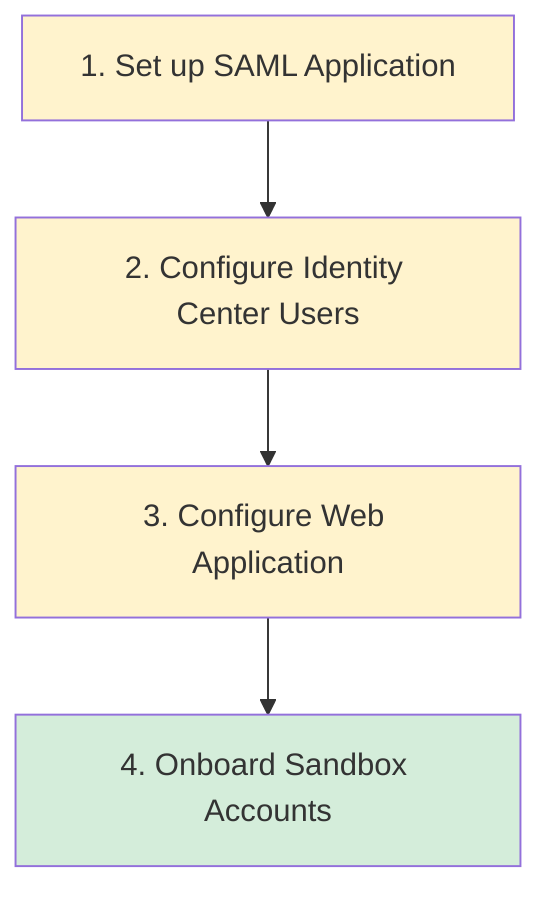

# Configure the Solution

After deploying all 4 CDK stacks, configure the solution to integrate with your organization's identity provider and onboard sandbox accounts.

## Configuration Flow

| Step | Where | What | Duration |
|------|-------|------|----------|
| [SAML Application](/docs/guide/configure/saml-application) | Management Account | Create SAML 2.0 app in IAM Identity Center | 10 min |
| [Identity Center Users](/docs/guide/configure/identity-center) | Management Account | Create users and assign to application | 10 min |
| [Web Application](/docs/guide/configure/web-application) | Hub Account | Configure the self-service portal | 5 min |
| [Onboard Accounts](/docs/guide/configure/onboard-accounts) | Hub Account | Register sandbox accounts in the pool | 5 min |

:::caution Account Context
The first two steps (SAML and Identity Center) are performed in the **management account** where IAM Identity Center is enabled. The remaining steps are performed in the **hub account**.
:::

## Steps

1. [Set up SAML 2.0 application](/docs/guide/configure/saml-application)
2. [Configure IAM Identity Center users](/docs/guide/configure/identity-center)
3. [Configure web application](/docs/guide/configure/web-application)
4. [Onboard sandbox accounts](/docs/guide/configure/onboard-accounts)
