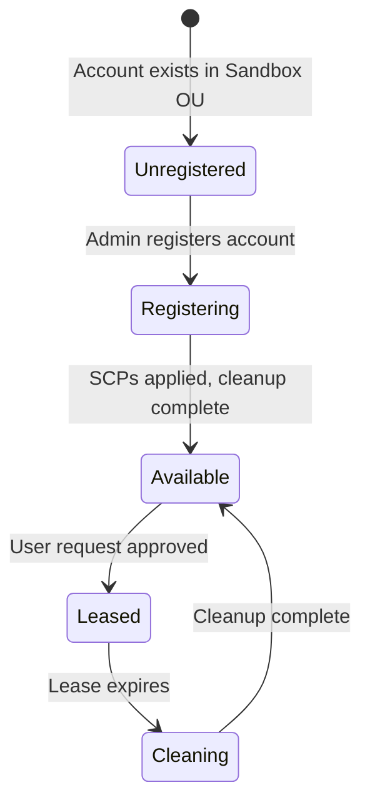

# Onboard Sandbox Accounts

Register your sandbox AWS accounts in the account pool so they're available for lease requests.

:::caution
Complete these steps in the **hub account** where the CDK stacks are deployed.
:::

## How Account Onboarding Works



When you register an account, the system:
1. Moves the account to the **Pool OU**
2. Applies Service Control Policies
3. Verifies the account is clean (no existing resources)
4. Marks it as **Available** in the account pool table

## Option 1: Onboard via Web Portal (Recommended)

1. Sign in to the portal as an **Administrator**
2. Navigate to **Account Management** → **Register Account**
3. Enter the sandbox account ID (e.g., `111111111111`)
4. Choose **Register**
5. Wait for the account to reach `Available` status

Repeat for each sandbox account.

## Option 2: Onboard via API

```bash
# Register a single account
curl -X POST "https://API_ENDPOINT/prod/accounts/register" \
  -H "Authorization: Bearer YOUR_TOKEN" \
  -H "Content-Type: application/json" \
  -d '{"accountId": "111111111111"}'
```

## Option 3: Onboard via DynamoDB (Direct)

For bulk registration or automation:

```bash
# Register account directly in DynamoDB
aws dynamodb put-item \
  --table-name Sandbox-AccountPool \
  --item '{
    "accountId": {"S": "111111111111"},
    "status": {"S": "available"},
    "registeredAt": {"S": "'$(date -u +%Y-%m-%dT%H:%M:%SZ)'"},
    "accountName": {"S": "Sandbox 001"}
  }' \
  --region ap-southeast-2
```

:::warning
Direct DynamoDB writes skip the SCP application and cleanup verification. Only use this method if you've manually prepared the accounts.
:::

## Verify Account Registration

```bash
# Check account status in the pool
aws dynamodb scan \
  --table-name Sandbox-AccountPool \
  --region ap-southeast-2 \
  --query "Items[].{AccountId:accountId.S,Status:status.S,Name:accountName.S}" \
  --output table
```

Expected output:
```
----------------------------------------------
|                   Scan                     |
+---------------+-----------+----------------+
|   AccountId   |  Status   |     Name       |
+---------------+-----------+----------------+
|  111111111111 |  available|  Sandbox 001   |
|  222222222222 |  available|  Sandbox 002   |
+---------------+-----------+----------------+
```

## Post-Onboarding Checklist

- [ ] All sandbox accounts show `available` status
- [ ] Accounts are in the **Pool OU** (check Organizations console)
- [ ] SCPs are applied to the Pool OU
- [ ] At least 2 accounts are available for testing
- [ ] Test the end-to-end flow: request → approve → access → expire

## Next Step

You've completed the configuration. Proceed to [Use the Solution](/docs/guide/use) to test the platform with each persona.
