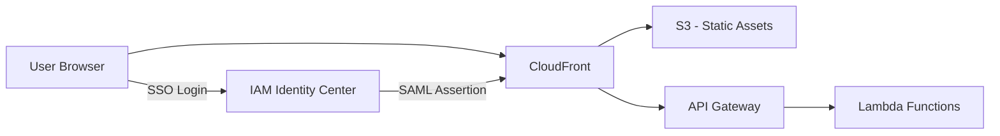

# Configure Web Application

Configure the Sandbox for AWS self-service portal with your deployment-specific settings.

:::caution
Complete these steps in the **hub account** where the CDK stacks are deployed.
:::

## Portal Overview

The web application is a React + Cloudscape UI single-page application hosted on CloudFront + S3. After deployment, it needs configuration to connect to your SAML provider and API backend.



## Step 1: Get Configuration Values

Gather these values from your stack outputs:

```bash
# API endpoint
aws cloudformation describe-stacks \
  --stack-name Sandbox-Compute \
  --region ap-southeast-2 \
  --query "Stacks[0].Outputs[?OutputKey=='ApiEndpoint'].OutputValue" --output text

# Web portal URL
aws cloudformation describe-stacks \
  --stack-name Sandbox-Compute \
  --region ap-southeast-2 \
  --query "Stacks[0].Outputs[?OutputKey=='WebPortalUrl'].OutputValue" --output text
```

## Step 2: Update Application Configuration

The web application reads configuration from a DynamoDB config table. Update it with your SAML and API settings:

```bash
aws dynamodb put-item \
  --table-name Sandbox-Config \
  --item '{
    "configKey": {"S": "portal"},
    "apiEndpoint": {"S": "https://xxxxxxxxxx.execute-api.ap-southeast-2.amazonaws.com/prod"},
    "samlEntityId": {"S": "YOUR_ENTITY_ID"},
    "samlAcsUrl": {"S": "YOUR_ACS_URL"},
    "portalUrl": {"S": "https://dxxxxxxxxxx.cloudfront.net"},
    "adminEmail": {"S": "admin@yourcompany.com"},
    "maxLeaseDurationHours": {"N": "72"},
    "defaultBudgetUsd": {"N": "50"}
  }' \
  --region ap-southeast-2
```

## Step 3: Upload SAML Metadata

Upload the SAML metadata file downloaded during [SAML Application setup](/docs/guide/configure/saml-application):

```bash
# Upload metadata to the artifacts bucket
aws s3 cp saml-metadata.xml \
  s3://sandbox-artifacts-ACCOUNT_ID/saml/metadata.xml \
  --region ap-southeast-2
```

## Step 4: Verify Portal Access

1. Open the **WebPortalUrl** in your browser
2. You should see the Sandbox for AWS login page
3. Click **Sign In** — this redirects to IAM Identity Center
4. Sign in with an assigned user
5. You should be redirected back to the portal with your role applied

## Configuration Reference

| Setting | Description | Default |
|---------|-------------|---------|
| `maxLeaseDurationHours` | Maximum lease duration users can request | 72 |
| `defaultBudgetUsd` | Default budget limit per sandbox account | 50 |
| `adminEmail` | Email for system notifications | Required |
| `autoApprove` | Auto-approve requests (skip manager approval) | `false` |
| `cleanupGracePeriodHours` | Hours after expiry before cleanup starts | 1 |

## Troubleshooting

| Issue | Cause | Fix |
|-------|-------|-----|
| Blank page after login | CORS misconfiguration | Verify API Gateway CORS includes CloudFront domain |
| SAML error on login | Metadata mismatch | Re-upload SAML metadata; verify ACS URL matches |
| "Unauthorized" after login | Group mapping incorrect | Verify user's Identity Center group matches expected roles |
| Portal shows but API fails | API endpoint wrong | Check DynamoDB config table `apiEndpoint` value |
