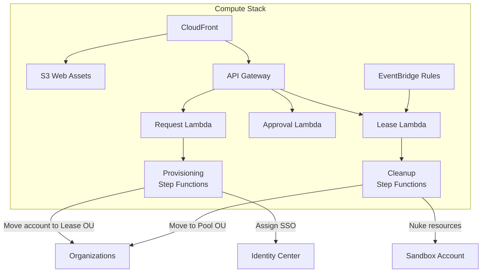

# Deploy the Compute Stack

The Compute stack is the final and largest stack. It creates the API Gateway, Lambda functions, Step Functions state machines, and the web portal that ties everything together.

## Prerequisites

- **Sandbox-IDC** stack deployed successfully
- **Sandbox-Data** stack deployed successfully

## What This Stack Creates

| Resource | Type | Purpose |
|----------|------|---------|
| REST API | API Gateway | Backend API for the web portal |
| Request Handler | Lambda | Processes sandbox requests |
| Approval Handler | Lambda | Processes manager approvals |
| Lease Manager | Lambda | Manages lease lifecycle |
| Cleanup Handler | Lambda | Nukes resources in expired accounts |
| Provisioning SM | Step Functions | Orchestrates account provisioning workflow |
| Cleanup SM | Step Functions | Orchestrates account cleanup workflow |
| Web Distribution | CloudFront | CDN for the web portal |
| Scheduled Rules | EventBridge | Periodic lease expiry checks |

## Stack Parameters

| Parameter | Required | Description |
|-----------|----------|-------------|
| All outputs from IDC stack | Yes | SAML provider ARN, ACS URL |
| All outputs from Data stack | Yes | Table names, bucket names, KMS key |
| `maxLeaseDuration` | No | Maximum lease duration in hours (default: 72) |
| `defaultBudget` | No | Default budget per sandbox in USD (default: 50) |

## Deploy

```bash
npx cdk deploy Sandbox-Compute --region ap-southeast-2
```

Or via Docker:

```bash
docker exec sandbox-dev npx cdk deploy Sandbox-Compute --region ap-southeast-2
```

:::info
The Compute stack takes longer to deploy (5-10 minutes) due to CloudFront distribution creation.
:::

## Verify Deployment

```bash
# Check stack status
aws cloudformation describe-stacks \
  --stack-name Sandbox-Compute \
  --region ap-southeast-2 \
  --query "Stacks[0].StackStatus"

# Get the API endpoint
aws cloudformation describe-stacks \
  --stack-name Sandbox-Compute \
  --region ap-southeast-2 \
  --query "Stacks[0].Outputs[?OutputKey=='ApiEndpoint'].OutputValue" --output text

# Get the web portal URL
aws cloudformation describe-stacks \
  --stack-name Sandbox-Compute \
  --region ap-southeast-2 \
  --query "Stacks[0].Outputs[?OutputKey=='WebPortalUrl'].OutputValue" --output text
```

## Stack Outputs

| Output | Description |
|--------|-------------|
| `ApiEndpoint` | REST API URL for backend operations |
| `WebPortalUrl` | CloudFront URL for the web portal |
| `UserPoolId` | Cognito User Pool ID (if using Cognito) |
| `ProvisioningStateMachineArn` | Step Functions ARN for provisioning |
| `CleanupStateMachineArn` | Step Functions ARN for cleanup |

:::tip Important
Record the **WebPortalUrl** — this is where users access the sandbox self-service portal. You'll configure it in the [web application step](/docs/guide/configure/web-application).
:::

## Architecture



## Troubleshooting

| Issue | Cause | Fix |
|-------|-------|-----|
| CloudFront distribution takes 15+ min | Normal for new distributions | Wait; check CloudFormation events |
| API Gateway 403 | CORS or auth misconfiguration | Check API Gateway stage and CORS settings |
| Lambda timeout | Cold start or large payloads | Increase timeout in CDK config; check CloudWatch Logs |
| Step Functions execution failed | Missing permissions | Check IAM role policies attached to state machine |

## All Stacks Deployed

After all 4 stacks are deployed, proceed to [Configure the Solution](/docs/guide/configure).
