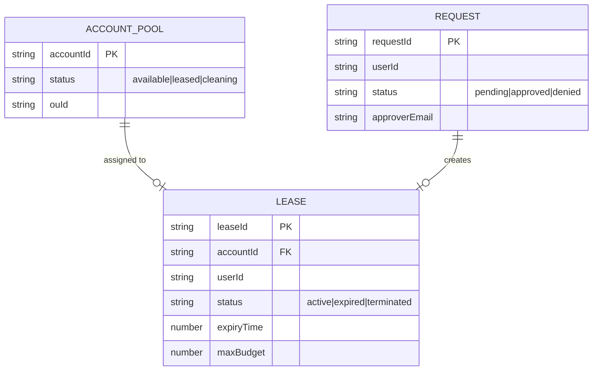

# Deploy the Data Stack

The Data stack creates the persistence layer: DynamoDB tables for lease and request tracking, S3 buckets for artifacts, and SES configuration for notifications.

## Prerequisites

- **Sandbox-AccountPool** stack deployed successfully

## What This Stack Creates

| Resource | Type | Purpose |
|----------|------|---------|
| Lease Table | DynamoDB | Tracks active leases, expiry times, user assignments |
| Request Table | DynamoDB | Stores sandbox requests and approval status |
| Config Table | DynamoDB | Platform configuration (durations, limits, SCPs) |
| Artifacts Bucket | S3 | CloudFormation templates, audit logs |
| Web Assets Bucket | S3 | Static web application hosting |
| SES Configuration | SES | Email notifications (approvals, expiry warnings) |
| KMS Key | KMS | Encryption for DynamoDB and S3 |

## Stack Parameters

| Parameter | Required | Description |
|-----------|----------|-------------|
| `accountPoolTableName` | Yes | From AccountPool stack outputs |
| `adminEmail` | Yes | Email for system notifications |
| `sesVerified` | No | Whether SES is in production mode (`true`/`false`) |

## Deploy

```bash
npx cdk deploy Sandbox-Data \
  --parameters adminEmail=admin@yourcompany.com \
  --region ap-southeast-2
```

Or via Docker:

```bash
docker exec sandbox-dev npx cdk deploy Sandbox-Data \
  --parameters adminEmail=admin@yourcompany.com \
  --region ap-southeast-2
```

## Verify Deployment

```bash
# Check stack status
aws cloudformation describe-stacks \
  --stack-name Sandbox-Data \
  --region ap-southeast-2 \
  --query "Stacks[0].StackStatus"

# Verify DynamoDB tables
aws dynamodb list-tables \
  --region ap-southeast-2 \
  --query "TableNames[?contains(@, 'Sandbox')]"

# Verify S3 buckets
aws s3 ls | grep -i sandbox
```

## Stack Outputs

| Output | Description |
|--------|-------------|
| `LeaseTableName` | DynamoDB table for lease tracking |
| `RequestTableName` | DynamoDB table for requests |
| `ConfigTableName` | DynamoDB table for configuration |
| `ArtifactsBucketName` | S3 bucket for artifacts |
| `WebBucketName` | S3 bucket for web assets |
| `KmsKeyArn` | KMS encryption key ARN |

```bash
aws cloudformation describe-stacks \
  --stack-name Sandbox-Data \
  --region ap-southeast-2 \
  --query "Stacks[0].Outputs"
```

## Data Model



## Troubleshooting

| Issue | Cause | Fix |
|-------|-------|-----|
| SES identity not verified | Email not confirmed | Check inbox for verification email, click link |
| KMS key creation failed | Service-linked role missing | Ensure `aws-service-role/dynamodb.amazonaws.com` exists |
| S3 bucket name conflict | Bucket name already exists globally | CDK generates unique names — redeploy if needed |
