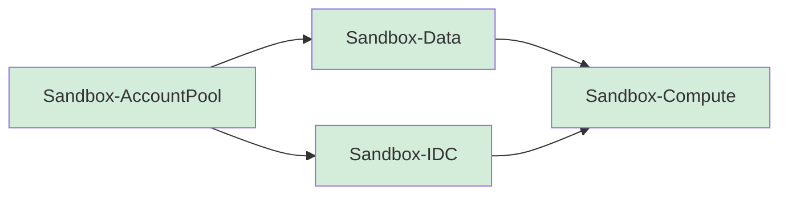

# Deploy the Solution

Sandbox for AWS consists of 4 CDK stacks deployed to the hub account in a specific order. Each stack builds on the resources created by its dependencies.

## Stack Deployment Order



| Order | Stack | CloudFormation ID | Dependencies |
|-------|-------|------------------|-------------|
| 1 | AccountPool | `Sandbox-AccountPool` | None |
| 2 | IDC | `Sandbox-IDC` | AccountPool |
| 3 | Data | `Sandbox-Data` | AccountPool |
| 4 | Compute | `Sandbox-Compute` | IDC, Data |

## Prerequisites Check

```bash
# Verify AWS credentials (hub account)
aws sts get-caller-identity --profile your-hub-profile

# Verify CDK is bootstrapped in the hub account
npx cdk bootstrap aws://HUB_ACCOUNT_ID/ap-southeast-2

# Synthesize templates first (validates before deploy)
npx cdk synth
```

:::caution Important
All stacks deploy to the **hub account**, not the management account. Ensure your AWS credentials point to the hub account before running `cdk deploy`.
:::

## Deployment Methods

**Docker-first** (recommended):
```bash
task synth
docker exec sandbox-dev npx cdk deploy --all
```

**Direct** (requires local Node.js 22+):
```bash
npx cdk deploy Sandbox-AccountPool
npx cdk deploy Sandbox-IDC
npx cdk deploy Sandbox-Data
npx cdk deploy Sandbox-Compute
```

## Steps

1. [Deploy AccountPool Stack](/docs/guide/deploy/account-pool-stack)
2. [Deploy IDC Stack](/docs/guide/deploy/idc-stack)
3. [Deploy Data Stack](/docs/guide/deploy/data-stack)
4. [Deploy Compute Stack](/docs/guide/deploy/compute-stack)
