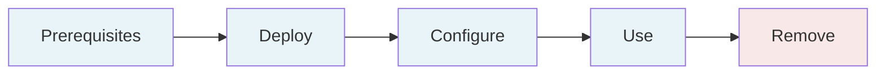

# Implementation Guide

This guide walks you through deploying, configuring, and operating Sandbox for AWS in your organization. Follow the sections in order for a complete end-to-end setup.

## Implementation Flow



## Sections

| Section | Duration | Description |
|---------|----------|-------------|
| [Prerequisites](/docs/guide/prerequisites) | 30 min | Set up AWS accounts, Organizations, and required services |
| [Deploy](/docs/guide/deploy) | 45 min | Deploy 4 CDK stacks to the hub account |
| [Configure](/docs/guide/configure) | 30 min | Set up SAML, Identity Center, web app, and onboard accounts |
| [Use](/docs/guide/use) | 20 min | Operate as administrator, manager, or end-user |
| [Remove](/docs/guide/remove) | 15 min | Clean teardown of all resources |

## Before You Begin

Ensure you have:

- An **AWS Organization** with a management account
- A dedicated **hub account** (not the management account) with `AdministratorAccess`
- At least **2 sandbox accounts** moved into a Sandbox OU
- **IAM Identity Center** enabled in your home region (`ap-southeast-2`)
- **Node.js 22+** and **AWS CLI v2** installed locally (or use the Docker-first workflow)

:::info Docker-First Alternative
If you prefer not to install Node.js locally, use the Docker-first workflow:
```bash
task docker:start       # Start sandbox-dev container
task synth              # Synthesize via Docker
task test:tier1:docker  # Run tests via Docker
```
:::

## Getting Help

If you encounter issues, see the [Troubleshooting](/docs/operations/troubleshooting) guide.
