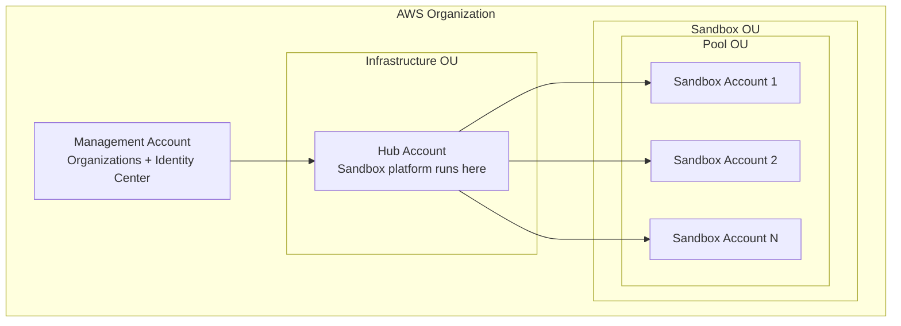

# Identify Required AWS Accounts

Sandbox for AWS requires three types of AWS accounts within your organization. This page helps you identify and prepare them.

## Account Types



### Management Account

The **organization management account** is where AWS Organizations and IAM Identity Center are enabled. You do NOT deploy CDK stacks here — it is only used for:

- AWS Organizations API access (account moves, OU management)
- IAM Identity Center configuration (SAML application, permission sets)
- Service Control Policy management

:::warning
Never deploy workloads directly in the management account. This is an AWS security best practice.
:::

### Hub Account

The **hub account** is a dedicated member account where all 4 CDK stacks are deployed. This account:

- Hosts the API Gateway, Lambda functions, Step Functions, and DynamoDB tables
- Hosts the web portal (CloudFront + S3)
- Receives delegated admin permissions from the management account
- Must have `AdministratorAccess` available for the deployment user/role

:::tip
Create a new account specifically for this purpose. Name it something identifiable like `sandbox-hub` or `platform-sandbox`.
:::

### Sandbox Accounts

**Sandbox accounts** are the accounts that end-users will receive temporary access to. You need at least 2 accounts to start, but more accounts means more concurrent sandbox leases.

Requirements for sandbox accounts:
- Must be member accounts in your AWS Organization
- Must be in (or movable to) the Sandbox OU
- Should be empty — no production workloads
- Will have Service Control Policies applied automatically

## Account Inventory

Before proceeding, document your accounts:

| Role | Account ID | Account Name | Status |
|------|-----------|--------------|--------|
| Management | `____________` | | Existing |
| Hub | `____________` | | Create if needed |
| Sandbox 1 | `____________` | | Create if needed |
| Sandbox 2 | `____________` | | Create if needed |

## Creating New Accounts

If you need to create the hub or sandbox accounts:

```bash
# Create hub account
aws organizations create-account \
  --email sandbox-hub@yourcompany.com \
  --account-name "Sandbox Hub" \
  --profile management-profile

# Create sandbox accounts
aws organizations create-account \
  --email sandbox-001@yourcompany.com \
  --account-name "Sandbox 001" \
  --profile management-profile
```

:::info
Account creation takes 1-5 minutes. Check status with:
```bash
aws organizations list-create-account-status --profile management-profile
```
:::
