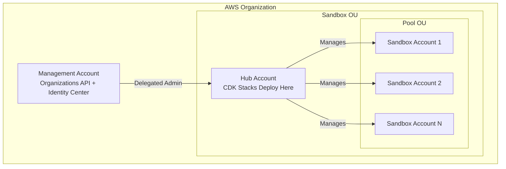

# Prerequisites

Before deploying Sandbox for AWS, set up the required AWS accounts, organizational structure, and services. This section takes approximately 30 minutes if you already have an AWS Organization.

## What You Need

| Requirement | Details |
|------------|---------|
| **AWS Organizations** | Active organization with a management account |
| **Hub Account** | Dedicated account for the sandbox platform (not the management account) |
| **Sandbox Accounts** | 2+ AWS accounts to use as sandbox environments |
| **IAM Identity Center** | Enabled in your home region |
| **Admin Access** | `AdministratorAccess` to the hub account |
| **AWS CLI v2** | Configured with SSO profiles |
| **Node.js 22+** | For CDK v2 synthesis and deployment (or use Docker) |

## Architecture

## Steps

1. [Identify required AWS accounts](/docs/guide/prerequisites/aws-accounts)
2. [Select your home region](/docs/guide/prerequisites/home-region)
3. [Set up AWS Organizations](/docs/guide/prerequisites/organizations)
4. [Enable required services](/docs/guide/prerequisites/enable-services)
