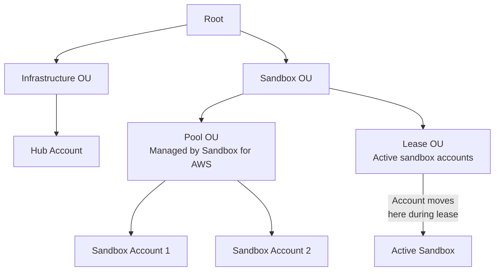

# Set Up AWS Organizations

Sandbox for AWS requires an organizational unit (OU) structure to manage sandbox accounts. The solution uses OUs to apply Service Control Policies and manage the account lifecycle.

## Required OU Structure



| OU | Purpose | Created By |
|----|---------|-----------|
| **Sandbox OU** | Top-level OU for all sandbox-related accounts | You (manually) |
| **Pool OU** | Holds available sandbox accounts | Sandbox for AWS (automatically) |
| **Lease OU** | Holds accounts with active leases | Sandbox for AWS (automatically) |

:::info
The Pool and Lease OUs are created automatically by the AccountPool stack. You only need to create the top-level **Sandbox OU** manually.
:::

## Step 1: Create the Sandbox OU

1. Sign in to the **management account**
2. Open the [AWS Organizations console](https://console.aws.amazon.com/organizations/)
3. Navigate to **Organize accounts**
4. Select the **Root**
5. Choose **Actions** → **Create new** → **Organizational unit**
6. Enter name: `Sandbox`

```bash
# Or via CLI
aws organizations create-organizational-unit \
  --parent-id r-xxxx \
  --name "Sandbox" \
  --profile management-profile
```

## Step 2: Move Sandbox Accounts to the Sandbox OU

Move your sandbox accounts into the new Sandbox OU:

```bash
# Get the Sandbox OU ID
aws organizations list-organizational-units-for-parent \
  --parent-id r-xxxx \
  --profile management-profile \
  --query "OrganizationalUnits[?Name=='Sandbox'].Id" --output text

# Move each sandbox account
aws organizations move-account \
  --account-id 111111111111 \
  --source-parent-id r-xxxx \
  --destination-parent-id ou-xxxx-sandbox \
  --profile management-profile
```

## Step 3: Verify Structure

```bash
# List accounts in the Sandbox OU
aws organizations list-accounts-for-parent \
  --parent-id ou-xxxx-sandbox \
  --profile management-profile \
  --query "Accounts[].{Id:Id,Name:Name,Status:Status}" \
  --output table
```

Expected output:
```
-------------------------------------------------
|            ListAccountsForParent              |
+---------------+-------------------+-----------+
|      Id       |       Name        |  Status   |
+---------------+-------------------+-----------+
|  111111111111 |  Sandbox 001      |  ACTIVE   |
|  222222222222 |  Sandbox 002      |  ACTIVE   |
+---------------+-------------------+-----------+
```

## Record the OU ID

Save the Sandbox OU ID — you'll need it when deploying the AccountPool stack:

```
Sandbox OU ID: ou-xxxx-xxxxxxxx
```
