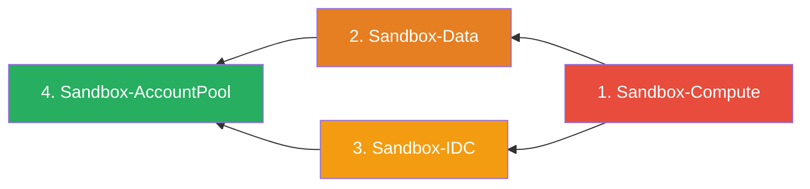

# Delete CloudFormation Stacks

Delete all four Sandbox for AWS CloudFormation stacks in reverse dependency order.

:::caution
Complete these steps in the **hub account**. Ensure you are in the home region (`ap-southeast-2`).
:::

## Deletion Order

Stacks **must** be deleted in reverse deployment order to respect resource dependencies:



## Step 1: Delete Sandbox-Compute

```bash
aws cloudformation delete-stack \
  --stack-name Sandbox-Compute \
  --region ap-southeast-2

aws cloudformation wait stack-delete-complete \
  --stack-name Sandbox-Compute \
  --region ap-southeast-2

echo "Sandbox-Compute deleted"
```

**Resources removed**: API Gateway, Lambda functions, Step Functions, WAF WebACL, CloudFront distribution.

## Step 2: Delete Sandbox-Data

```bash
aws cloudformation delete-stack \
  --stack-name Sandbox-Data \
  --region ap-southeast-2

aws cloudformation wait stack-delete-complete \
  --stack-name Sandbox-Data \
  --region ap-southeast-2

echo "Sandbox-Data deleted"
```

**Resources removed**: DynamoDB tables, S3 buckets, SES configuration, EventBridge rules.

:::warning S3 Bucket Retention
If the stack fails to delete due to non-empty S3 buckets, empty them first:
```bash
aws s3 rm s3://sandbox-data-ACCOUNT_ID --recursive
```
:::

## Step 3: Delete Sandbox-IDC

```bash
aws cloudformation delete-stack \
  --stack-name Sandbox-IDC \
  --region ap-southeast-2

aws cloudformation wait stack-delete-complete \
  --stack-name Sandbox-IDC \
  --region ap-southeast-2

echo "Sandbox-IDC deleted"
```

**Resources removed**: IAM roles, Lambda functions for SAML integration, Secrets Manager secrets.

## Step 4: Delete Sandbox-AccountPool

```bash
aws cloudformation delete-stack \
  --stack-name Sandbox-AccountPool \
  --region ap-southeast-2

aws cloudformation wait stack-delete-complete \
  --stack-name Sandbox-AccountPool \
  --region ap-southeast-2

echo "Sandbox-AccountPool deleted"
```

**Resources removed**: Organizations OU management, account pool tracking, CodeBuild projects.

## Step 5: Verify Complete Deletion

```bash
# Confirm no Sandbox stacks remain
aws cloudformation list-stacks \
  --stack-status-filter CREATE_COMPLETE UPDATE_COMPLETE \
  --region ap-southeast-2 \
  --query "StackSummaries[?starts_with(StackName, 'Sandbox-')].{Name:StackName,Status:StackStatus}" \
  --output table
```

Expected output: No results (empty table).

## Next Step

Proceed to [Delete SAML Application](./delete-saml.md) to remove the Identity Center configuration.
