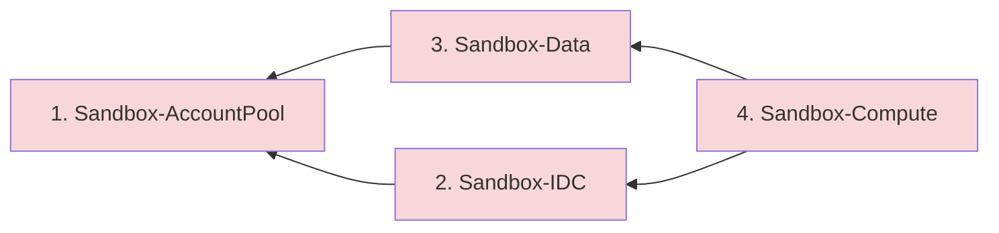

# Remove the Solution

If you deployed Sandbox for AWS in a test environment and need to remove it completely, follow these steps. Expected duration: approximately 15 minutes.

:::danger Irreversible Action
Removing the solution deletes all CloudFormation stacks, DynamoDB tables, S3 buckets, and associated resources. Active leases will be terminated immediately. Notify all users before proceeding.
:::

## Removal Order

Stacks must be deleted in **reverse deployment order** to respect dependencies:



## Step 1: Remove Compute and Data Stacks

:::caution
Complete these steps in the **hub account**. Ensure you are in the correct home region (`ap-southeast-2`).
:::

1. Sign in to the **hub account**
2. Open the [CloudFormation console](https://console.aws.amazon.com/cloudformation/)
3. Select **Sandbox-Compute** → Choose **Delete** → Wait for completion
4. Select **Sandbox-Data** → Choose **Delete** → Wait for completion

```bash
# Or via CLI
aws cloudformation delete-stack --stack-name Sandbox-Compute --region ap-southeast-2
aws cloudformation wait stack-delete-complete --stack-name Sandbox-Compute --region ap-southeast-2
aws cloudformation delete-stack --stack-name Sandbox-Data --region ap-southeast-2
aws cloudformation wait stack-delete-complete --stack-name Sandbox-Data --region ap-southeast-2
```

## Step 2: Remove IAM Identity Center Application

:::caution
Complete these steps in the **management account** where AWS IAM Identity Center is configured.
:::

1. Sign in to the **management account**
2. Open the [IAM Identity Center console](https://console.aws.amazon.com/singlesignon/)
3. Navigate to **Applications** → **Customer managed** tab
4. Select your Sandbox for AWS application
5. Choose **Actions** → **Remove**
6. Enter the application name to confirm

## Step 3: Remove Remaining Stacks

1. Open the [CloudFormation console](https://console.aws.amazon.com/cloudformation/)
2. Select **Sandbox-IDC** → Choose **Delete** → Wait for completion
3. Select **Sandbox-AccountPool** → Choose **Delete** → Wait for completion

```bash
aws cloudformation delete-stack --stack-name Sandbox-IDC --region ap-southeast-2
aws cloudformation wait stack-delete-complete --stack-name Sandbox-IDC --region ap-southeast-2
aws cloudformation delete-stack --stack-name Sandbox-AccountPool --region ap-southeast-2
aws cloudformation wait stack-delete-complete --stack-name Sandbox-AccountPool --region ap-southeast-2
```

## Step 4: Close Sandbox Accounts (Optional)

:::warning
Before closing AWS accounts, read the [AWS account closure process](https://docs.aws.amazon.com/accounts/latest/reference/manage-acct-closing.html). Account closure is irreversible after the 90-day grace period.
:::

1. Open the [AWS Organizations console](https://console.aws.amazon.com/organizations/) in the management account
2. Navigate to the Sandbox OU
3. For each sandbox account: Select → **Actions** → **Close** → Confirm with account ID

## Verification

```bash
# Confirm no Sandbox stacks remain
aws cloudformation list-stacks \
  --stack-status-filter CREATE_COMPLETE UPDATE_COMPLETE \
  --region ap-southeast-2 \
  --query "StackSummaries[?starts_with(StackName, 'Sandbox-')]"
```
