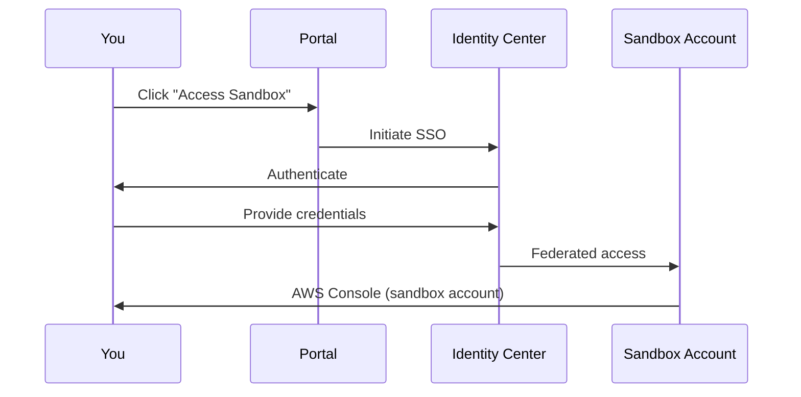

# Use as an End-User

End-users request temporary sandbox accounts for experimentation, learning, and development. This tutorial walks through the end-user workflow.

## End-User Capabilities

| Task | Description |
|------|-------------|
| Request sandbox | Submit a request for a temporary AWS account |
| Access sandbox | Log in to the sandbox account via SSO |
| View lease status | Check remaining time and budget |
| Request extension | Ask for more time before lease expires |

## Sign In

1. Open the web portal URL
2. Sign in via IAM Identity Center with an account in the `SandboxUsers` group
3. You should see the **User Dashboard** with your active and past sandboxes

## Request a Sandbox Account

1. From the dashboard, choose **Request Sandbox**
2. Fill in the request form:

| Field | Description | Example |
|-------|-------------|---------|
| **Justification** | Why you need a sandbox | "Testing new Lambda deployment pipeline" |
| **Duration** | How long you need it (hours) | 24 |
| **Budget** | Maximum spend in USD | 25 |

3. Choose **Submit Request**
4. You'll receive an email confirmation that your request is pending

:::info
A manager must approve your request before a sandbox is provisioned. Approval typically happens within a few hours, depending on your organization's policy.
:::

## Access Your Sandbox

After your request is approved:

1. You receive an **email notification** with access details
2. In the portal, your new sandbox appears under **My Sandboxes**
3. Choose **Access Sandbox** to open the AWS Console via SSO

### What You Can Do

In your sandbox account, you can:
- Create and manage AWS resources within allowed services
- Deploy CloudFormation stacks
- Run Lambda functions, create S3 buckets, launch EC2 instances
- Test infrastructure-as-code configurations

### What You Cannot Do

Service Control Policies restrict:
- Using non-approved regions
- Creating IAM users or access keys
- Accessing AWS Organizations or Account management
- Using high-cost services (unless explicitly allowed)

## Monitor Your Lease

The dashboard shows:

| Status | Meaning |
|--------|---------|
| **Active** | Sandbox is provisioned and accessible |
| **Expiring Soon** | Less than 24 hours remaining |
| **Expired** | Lease ended, cleanup in progress |
| **Cleaned** | Account returned to pool |

## Request a Lease Extension

If you need more time:

1. Navigate to **My Sandboxes**
2. Find the active sandbox
3. Choose **Request Extension**
4. Enter the additional hours needed and justification
5. Choose **Submit**

The extension request goes to a manager for approval.

## Budget Monitoring

Your dashboard shows current spend vs. budget limit:

- **Green**: Under 50% of budget
- **Yellow**: 50-80% of budget
- **Red**: Over 80% of budget

:::warning
If spend reaches 100% of budget, the lease is automatically terminated and the account enters cleanup. Save your work before reaching the budget limit.
:::

## When Your Lease Expires

When a lease expires:
1. You receive a notification email
2. SSO access is revoked
3. All resources in the sandbox account are deleted
4. The account is returned to the pool

:::tip
Save any important outputs (CloudFormation templates, configuration files, test results) to your local machine or a shared repository before the lease expires. Nothing persists after cleanup.
:::
