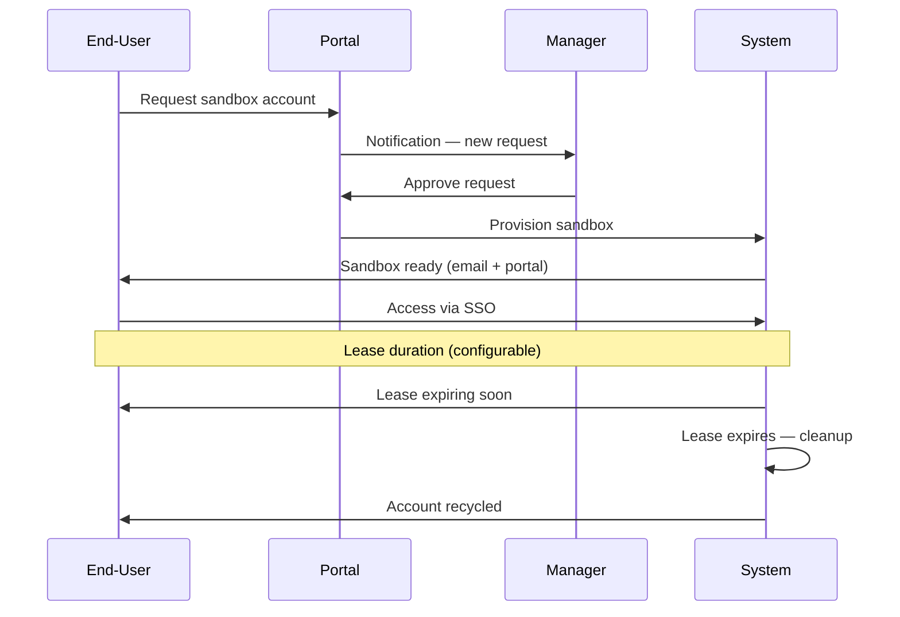

# Use the Solution

Sandbox for AWS supports three user personas, each with different capabilities and access levels.

## Personas

| Persona | Capabilities | Access Level |
|---------|-------------|-------------|
| [Administrator](/docs/guide/use/administrator) | Full platform management, account registration, SCP configuration | Hub account admin |
| [Manager](/docs/guide/use/manager) | Approve/deny requests, extend leases, view reports | Portal manager role |
| [End-User](/docs/guide/use/end-user) | Request sandbox, access AWS Console via SSO, view lease status | Portal user role |

## Typical Workflow

## Tutorials

1. [Use as an administrator](/docs/guide/use/administrator)
2. [Use as a manager](/docs/guide/use/manager)
3. [Use as an end-user](/docs/guide/use/end-user)
