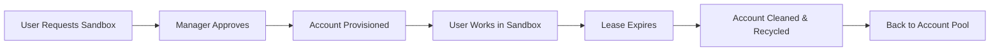
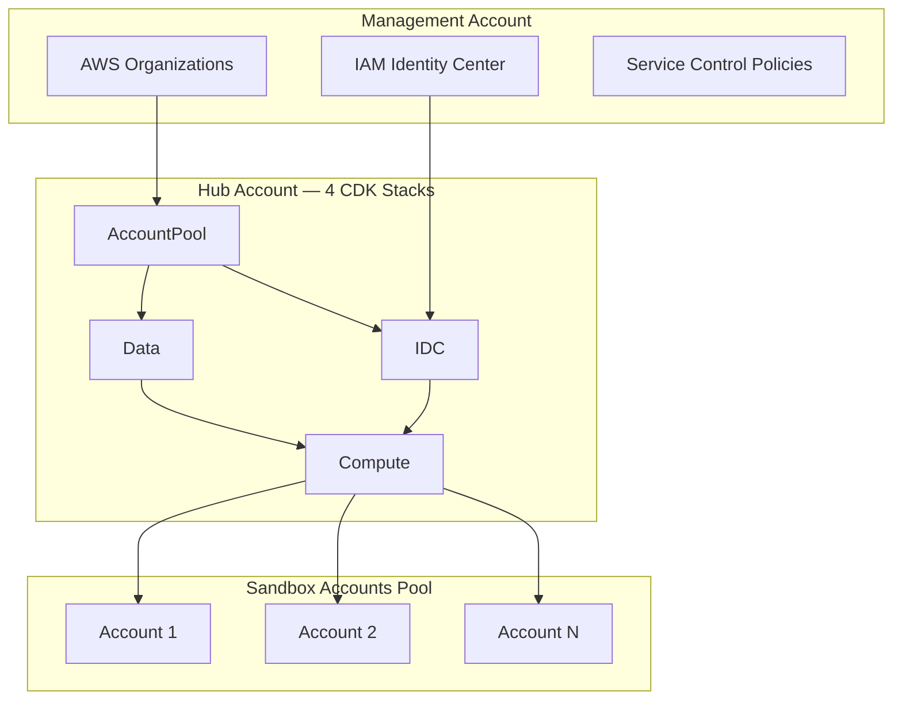

# Sandbox for AWS

Sandbox for AWS automates the lifecycle of temporary AWS sandbox accounts within your organization. It provisions isolated environments with guardrails, enforces spend controls via Service Control Policies, and automatically recycles accounts when leases expire.

## What It Does



| Capability | Description |
|-----------|-------------|
| **Account Pooling** | Pre-created AWS accounts ready for instant provisioning |
| **Lease Management** | Time-bound access with configurable durations |
| **Service Control Policies** | Restrict sandbox accounts to approved services and regions |
| **Spend Controls** | Budget limits per account with automatic notifications |
| **Automatic Cleanup** | Nuke all resources and reset accounts when leases expire |
| **Self-Service Portal** | Web application for requesting, approving, and managing sandboxes |

## Architecture

Sandbox for AWS deploys into a **hub account** within your AWS Organization using four CDK stacks:



| Stack | CloudFormation ID | Purpose |
|-------|------------------|---------|
| AccountPool | `Sandbox-AccountPool` | Account lifecycle, pool management, OU structure |
| IDC | `Sandbox-IDC` | IAM Identity Center integration, SAML federation |
| Data | `Sandbox-Data` | DynamoDB tables, S3 buckets, SES email notifications |
| Compute | `Sandbox-Compute` | Lambda functions, Step Functions, API Gateway, web portal |

## Quick Start

```bash
# Clone and install
git clone https://github.com/nnthanh101/aws-sandbox.git
cd aws-sandbox && npm install

# Local development (Docker-first)
task docker:start
task test:tier1:docker    # Snapshot tests (2-3s, free)
task frontend:dev         # UI at http://localhost:5173
task docs:dev             # Docs at http://localhost:3001
```

## Next Steps

- [**Implementation Guide**](/docs/guide) — Step-by-step deployment and configuration
- [**Architecture**](/docs/architecture/overview) — Deep dive into the 4 CDK stacks
- [**Development**](/docs/development/local-first) — Local-First Hybrid-Cloud setup
