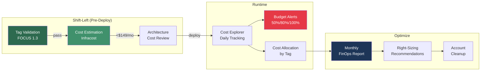

# Cost Management

Sandbox for AWS integrates with AWS cost management tools and supports FOCUS 1.2+ allocation tags.

## Cost Components

| Component | Estimated Cost | Notes |
|-----------|---------------|-------|
| Platform (hub account) | $36-149/month | Lambda, DynamoDB, API GW, S3 |
| Per sandbox account | Variable | Depends on user activity |
| IAM Identity Center | Free | Included with AWS Organizations |

## FOCUS Cost Allocation Tags

Enterprise cost allocation tags follow the FOCUS 1.2+ standard:

| Tag Key | Example Value | Purpose |
|---------|--------------|---------|
| `focus:ServiceName` | `sandbox-for-aws` | Service identification |
| `focus:ServiceCategory` | `Platform` | Category classification |
| `focus:ChargeCategory` | `Usage` | Charge type |
| `CostCenter` | `IT-Platform-001` | Business cost center |
| `Environment` | `sandbox` | Environment type |
| `Owner` | `platform-team` | Responsible team |

## Infracost Shift-Left Estimation

Estimate costs before deployment using Infracost:

```bash
# Estimate all stacks
task cost:estimate

# Estimate a single stack
task cost:estimate:stack -- Sandbox-Compute
```

## Budget Controls

Each sandbox account can have budget limits:
- Default per-account budget: $50/month
- Budget alerts at 50%, 80%, 100%
- Automatic freeze at 100% (configurable)

## FinOps Workflow



## FOCUS 1.3 Tag Compliance

All AWS resources must include these required tags for cost allocation:

| Tag Key | Example Value | FOCUS 1.3 Mapping |
|---------|--------------|-------------------|
| `CostCenter` | `IT-Platform-001` | `x_CostCenter` |
| `Environment` | `sandbox` | `x_Environment` |
| `Project` | `sandbox-for-aws` | `x_Project` |
| `Owner` | `platform-team` | `x_Owner` |

Validate tag compliance before deployment:

```bash
# Check all synthesized templates for required tags
task finops:validate-tags

# Evidence saved to tmp/aws-sandbox/finops-reports/
```

## Cost-Aware Architecture

The cost-aware architecture diagram (`docs/static/diagrams/cost_architecture.png`) shows resource-level cost breakdown. Generate with `task diagrams:generate`.

| Layer | Components | Monthly Cost |
|-------|-----------|-------------|
| Edge | CloudFront, API Gateway | $5-15 |
| Compute | 21 Lambdas, Step Functions | $10-50 |
| Data | DynamoDB, S3, KMS | $15-60 |
| Identity | IAM Identity Center | $0 (free) |
| **Total** | **Hub account** | **$36-149** |

## Monitoring Costs

```bash
# View sandbox account costs
aws ce get-cost-and-usage \
  --time-period Start=2024-01-01,End=2024-01-31 \
  --granularity MONTHLY \
  --metrics BlendedCost \
  --group-by Type=TAG,Key=Environment \
  --filter '{"Tags": {"Key": "Environment", "Values": ["sandbox"]}}' \
  --region ap-southeast-2
```
