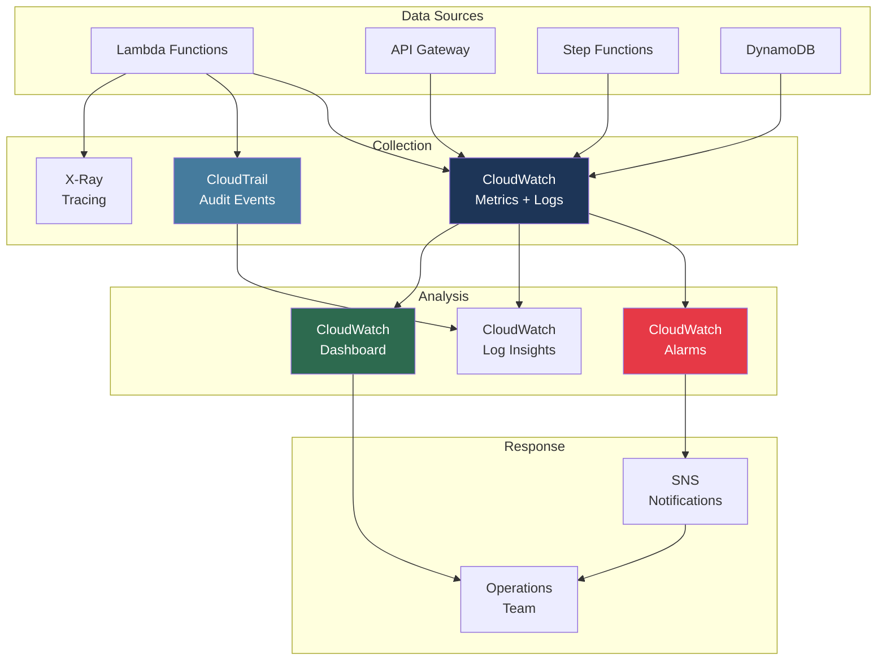

# Monitoring

Sandbox for AWS provides CloudWatch-based observability for the platform and sandbox accounts.

## CloudWatch Dashboard

Key metrics displayed on the platform dashboard:

| Metric | Description | Alarm Threshold |
|--------|-------------|----------------|
| Active Leases | Number of currently active leases | None (informational) |
| Available Accounts | Accounts available in the pool | < 2 (warning) |
| API Error Rate | 5xx error percentage | > 5% |
| Cleanup Duration | Time to clean a sandbox account | > 2 hours |
| Lambda Errors | Function invocation errors | > 0 per 5 min |
| DynamoDB Throttles | Read/write throttle events | > 0 |

## Log Groups

| Log Group | Source | Retention |
|-----------|--------|-----------|
| `/aws/lambda/Sandbox-*` | Lambda functions | 90 days |
| `/aws/apigateway/Sandbox-*` | API Gateway access logs | 90 days |
| `/aws/stepfunctions/Sandbox-*` | Step Functions execution logs | 90 days |

## Alarms

### Critical Alarms

- **No Available Accounts** — Account pool exhausted
- **Cleanup Failure** — Account cleanup state machine failed
- **API 5xx Spike** — Backend error rate above threshold

### Warning Alarms

- **High API Latency** — P99 latency above 3 seconds
- **DynamoDB Capacity** — Consumed capacity approaching limit
- **Budget Alert** — Sandbox account approaching budget limit

## Observability Stack



## Local Docker Health Monitoring

For local development, monitor container health with:

```bash
# Full health check (CPU, memory, status, LocalStack services)
task docker:health

# Collect container logs to evidence
task docker:logs:collect

# Quick status
task docker:status
```

Evidence saved to `tmp/aws-sandbox/health/` and `tmp/aws-sandbox/container-logs/`.

## Log Archiving

Logs are archived to S3 for long-term retention:

```bash
# View archived logs
aws s3 ls s3://sandbox-log-archive/ --recursive
```
